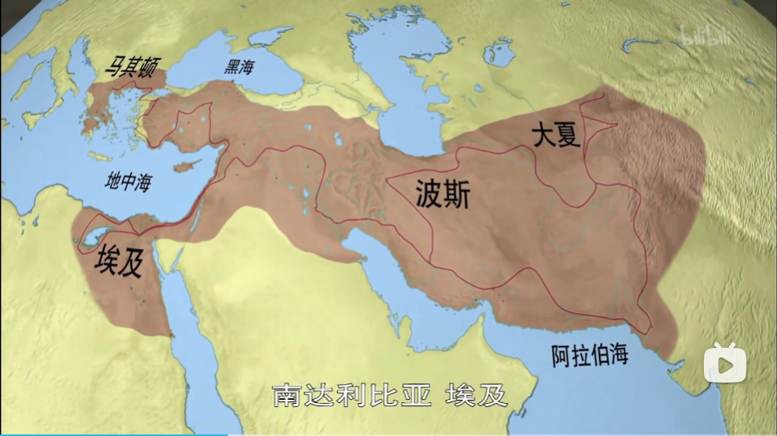

## [希腊化时代](https://www.bilibili.com/bangumi/play/ep517679/)

BC334，亚历山大三世东征波斯国 - BC31，罗马征服埃及托勒密王朝

### 前期
- BC400后半叶，希腊城邦制度衰微
- 马其顿王国国王腓力二世，BC338，克罗尼亚战役挫败雅典，建立霸权。

### 亚历山大
1. 腓力二世儿子，BC356-BC323。
1. BC335，组建三万步兵、五千骑兵、160战舰。
2. BC333，大破十万**波斯**军，俘虏波斯国王大流士三世的母亲妻子和女儿。
4. 南下占领腓尼基、巴勒斯坦、埃及，被承认为阿蒙神之子、埃及法老合法继承人。
5. BC331，北上在亚述古都再败波斯军。
6. 烧杀抢掠。
7. 大流士三世被谋反的地方总督背刺。
8. 到达如今巴基斯坦地区，印度北部。
9. BC324，返回**巴比伦**（如今**伊拉克**），定都。

### 统治
- 70+军事要塞，都叫亚历山大里亚。最大的在埃及开罗。东地中海最大港口，很重要。
- 促进民族融合，强硬通婚。自己以身作则。马其顿人与亚洲人通婚免税。

### 后期
- 亚历山大去世时没有指定继承人。权力真空，总督相互攻伐。
- 亚历山大四世在三世死后出生，几年后被杀害。
- 三分天下：**塞琉古**王国、**托勒密**王国、**安提柯**王国，地处亚、非、欧。

### 哲学基地在雅典
- 自我满足、反对趋炎附势；
- **伊比鸠鲁**学派：**享乐**主义，提倡**出世**、节制、清心寡欲，BC400-AD400。
- **斯多葛**学派：理性、节制、苦行、反对快乐。
- **犬儒**学派：回归原始，放弃享乐。
- 阿基米德：BC287-BC212。