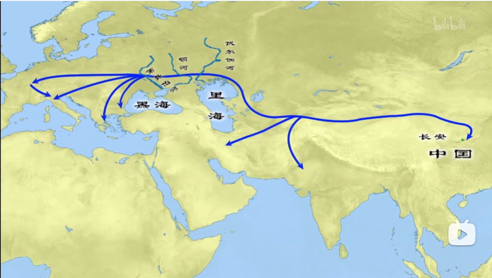
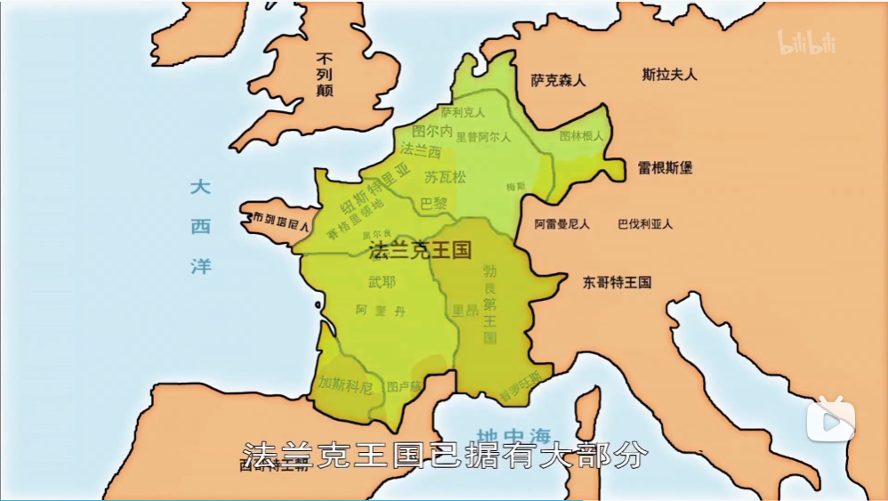
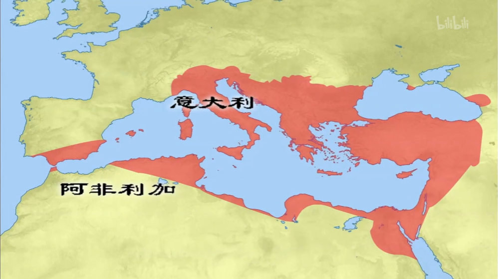
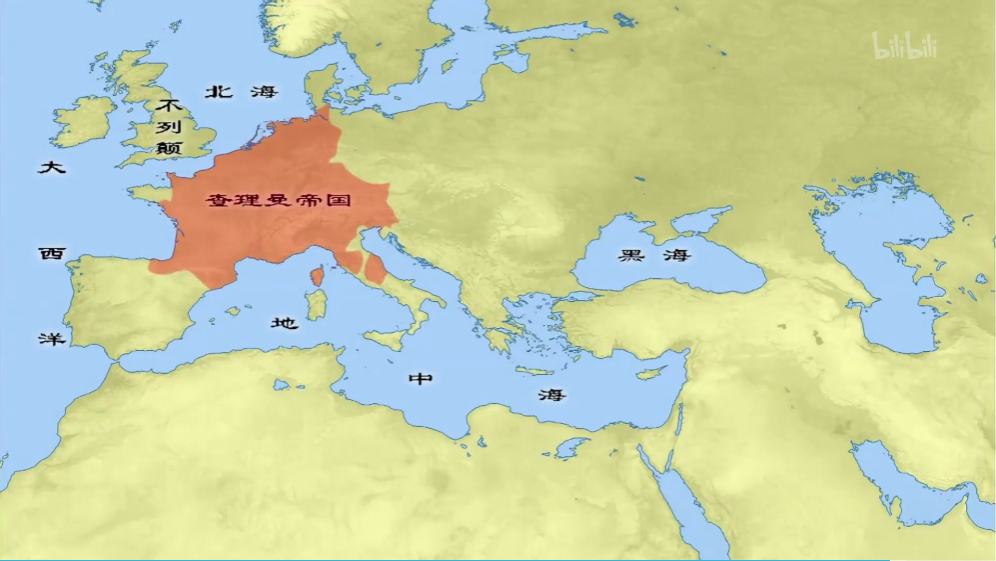
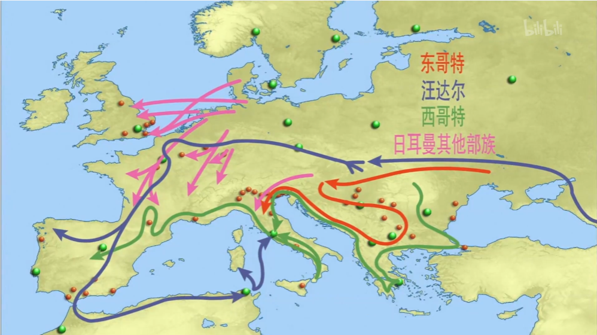

## [亚欧民族大迁徙与中世纪的开端](https://www.bilibili.com/bangumi/play/ep517741)

匈奴:
1. 被汉帝国打跑，开始迁徙。
2. 首先西域、中亚。
3. 4世纪-5世纪，到达印度，灭亡**笈多帝国**。形成**大乘佛教**。
4. 欧洲人称匈奴为**Huns**，来源于“匈奴”。
5. 被波斯人联合突厥人击垮，印度进入**戒日王帝国**。

:::note 随笔
为什么一定要迁徙呢？我所理解的冲突都是打败了就退嘛。有可能是因为西伯利亚环境恶劣，而南边又被汉守着，只好横向转移了。
这暗示了地理条件的影响。
:::

**突厥**人驱赶**柔然**人西迁。6世纪，柔然人在欧洲被称为**阿瓦尔**人。

370年，匈奴人越过伏尔加河打阿兰人。
阿兰人攻打日耳曼**东哥特**人（位于顿河、第聂伯河之间）。

罗马情况：
- 重税，经济凋敝，民怨沸腾
- 人民不想当兵，军事大权落入蛮族手中。
- 325年，君士坦丁皈依基督教。
- **395年**，东西罗马**分裂**。

连锁反应：
1. **匈奴**人入侵**东哥特**人。
2. 东哥特人逃入**西哥特**人的领地。
3. 西哥特人被迫南移，渡过**多瑙河**，经过罗马帝国。
4. 一开始还和和气气，请求罗马接纳。
5. 迁徙人数过多，没饭吃，加上罗马长官伺机拐卖西哥特人，导致西哥特人反抗。
6. 378年，罗马军队被全歼。

西哥特人：
- 利用罗马分裂，先后转战希腊、意大利。
- 洗劫罗马
- 于**高卢、西班牙**建立西哥特王国。

第二次洗劫：
- 406年，东北欧汪达尔人、阿兰人、苏维汇人，越过莱茵河进入西班牙。
- 439年，**汪达尔**人进入罗马北非首府**迦太基**，建国。
- **455年**，汪达尔人北上洗劫罗马城。
  
匈奴的扩张：
- 434年，匈奴人以匈牙利平原为基地，向四周抢劫。
- **“上帝之鞭”阿提拉**为当时首领。
- 日耳曼人、罗马人、高卢人联合抵抗，成功击败。

5世纪，**勃艮第**人从东北欧进入**高卢东南**部，建国。
盎格鲁人、撒克逊人、朱特人登岛。

西罗马皇帝由日耳曼长官废立。476年，西罗马末代皇帝罗慕路斯奥古斯都被废黜。
东哥特人在意大利建国。
486年，日耳曼人在高卢北部建立**法兰克**王国。

:::note 随笔
以前不明白为什么要有傀儡皇帝这样的存在，现在明白了。

一方面是为了名正言顺，统治明面上还是交由皇帝，一切制度还是沿袭旧制，而实际控制人可以退居幕后，用登不上台面的、不成文的手段来控制皇帝。维持秩序照旧，可以少一点麻烦，少一些抵抗；另一方面，就是设置代理人。外族并不想处理国内政务，所以皇帝还是需要的。他们对这个国家和皇帝不感兴趣，他们只想要窃取这个国家的资源和成果，需要在其中有人保障他们的利益就够了。
:::

东罗马复国：
- 查士丁尼，483-565。
- 533年，灭亡汪达尔王国。
- 535年，借口东哥特王国内讧进入意大利。东哥特人顽强抵抗，而且东罗马不得民心，打了20多年。
  - 罗马教皇在意大利中部势力加强。
  - 意大利此后长达1000年处于割据状态，让罗马教皇浑水摸鱼。
- 554年，成功征服东哥特王国。
- 568年，伦巴德人又把意大利抢走了。

斯拉夫人：
- 在伦巴德人之后，阿瓦尔人进入欧洲，使斯拉夫人向西、向南迁徙，来到多瑙河北岸。
- 向南打罗马，再进入巴尔干半岛，是塞尔维亚、克罗地亚、保加利亚的雏形。

大一统的尝试：
- 法兰克王国改朝换代，查理曼大帝开始征服欧洲。
- 800，查理曼被罗马教皇加冕为罗马皇帝。
- 可惜分家了，变成如今法兰西、德意志、意大利。

9世纪中叶，英格兰诞生。

