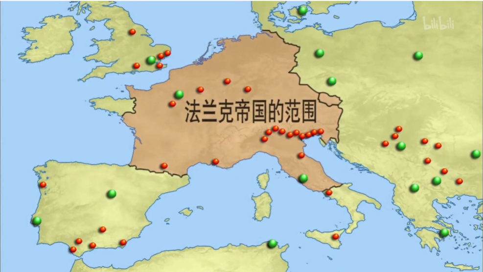

## [西欧封建国家](https://www.bilibili.com/bangumi/play/ep517742)

日耳曼国家都精神上仰慕罗马。

法兰克王国;
- 5世纪-9世纪。
- 由**克洛维**建立，皈依基督教。与教皇合作。
- 克洛维死后，权力流向宫相。国家分裂。
- 7世纪末，宫相**查理马特**带领法兰克振兴。
- 查理马特儿子，**矮子丕平**继承宫相，想当皇上。
- 矮子丕平废帝，开启**加洛林王朝**

查理大帝：
- 771，矮子丕平儿子查理即位，即查理大帝。
- 国势强盛
- 穷兵黩武。800年，法兰克版图相当于罗马欧洲部分。
- 查理被寄予厚望，视为罗马帝国继承人。
- 死后国家散了。

查理帝国诞生了西欧封建制度。因此，查理曼被誉为“欧洲之父”。

《凡尔登条约》：
- 843年，查理大帝的孙子缔结。
- 国家三分东、中、西。
- 东演变为**德意志**王国，西演变为**法兰西**王国。但中不是现代意义的意大利。

不列颠：
- 5世纪，日耳曼人登岛。
- 7世纪初，不列颠到有七个国家。
- 9世纪，威塞克斯扫清六合，席卷八荒，形成大一统的英格兰。
- 英格兰建国同时遭受丹麦人海盗袭击。
- 丹麦人定居，移民涌入。
- 阿丁根战役，反击胜利。而且丹麦人运气背，船翻了。
- 886年，划界。泰晤士河以南给威塞克斯，以北给丹麦人。
- 丹麦人继续入侵。10世纪开始收岁币。
- 11世纪，丹麦人当英格兰国王。
- 威塞克斯又夺回来，20年后就被诺曼人打了。

西欧封建制度：
- 中世纪国家原始，没有统一民族国家、主权国家。
- 贵族蓄养武装家丁，赐土。这就是封君、封臣和封土。
- 公爵权势可能超越国王。法国初期国王领地小于**诺曼底公爵、阿奎丹公爵、安茹伯爵**。
- 城堡不仅是住所，还是军事要塞。领主卧室可能还放着武器和战马。

:::note 随笔
权力和武力直接挂钩。权力中心就是军事中心。领主的权力来自实打实的军事控制。
:::

11世纪，西欧国家开始加强中央权力。

英国：
- 诺曼底公爵去英国当国王，开始加强王权，但遭贵族抵抗。
- 13世纪后期，形成**议会君主制**。

13世纪末，法国可以控制大部分领土，物质力量超越所有贵族。

英法百年战争：
- 1337-1453年，战场在法国
- **贞德**出现，号召人民反抗。被内鬼封建主抓住，被英国火刑。
- 贞德象征着民族意识和国家意识。
- 法国获胜，王权加强，逐渐形成**绝对君主制**。
- 英国陷入内战，进入都铎王朝，也推进到绝对君主制。代表：伊丽莎白女王。

神圣罗马帝国：
- 936，**奥托**继承德意志王国。
- 制服公爵，王权**比较**强大。
- 扩张领土。961，占北意大利，在圣彼得大教堂加冕为皇帝。
- 自称加洛林帝国继承者，重现罗马荣耀，实现西欧大一统。
- 然而德意志本身就没统一。
- 奥托的继任者没学到他的王权，反而学到他的领土扩张。
- 热衷于打意大利。
- 诸侯林立，有脱离的趋势。德意志一盘散沙到近代。
- “神圣罗马帝国既不神圣，也不罗马，更不帝国”

