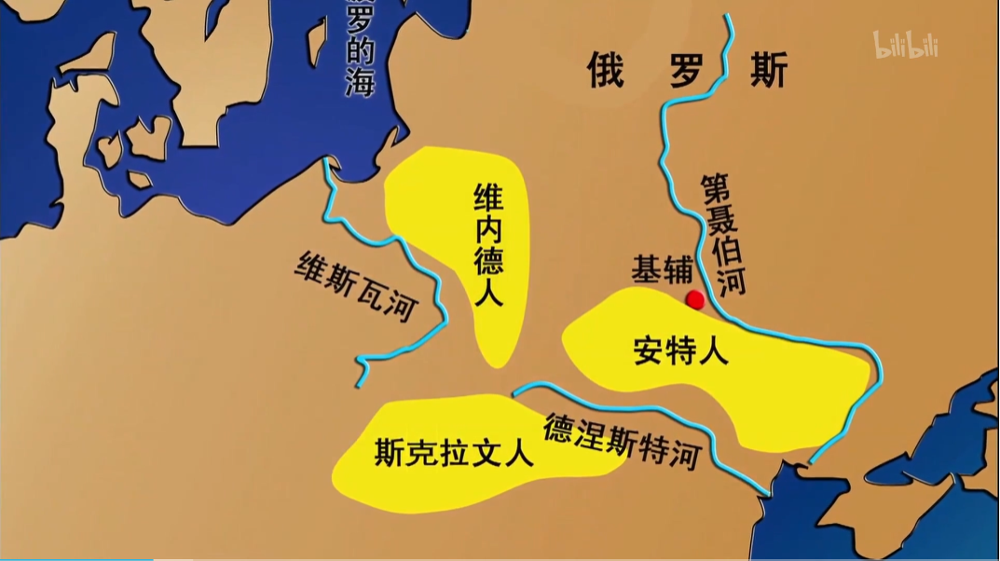
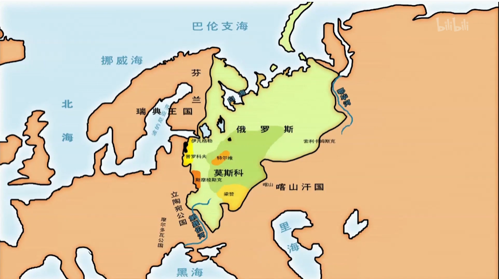

<iframe src="https://www.bilibili.com/bangumi/play/ep517744" width="100%" style="max-width: 700px;" height="600px"></iframe>

### 斯拉夫始祖传说
- **潘诺**有三个儿子：**列赫**、**捷克**、**罗斯**
- 列赫 —— 波兰人
- 捷克 —— 捷克人
- 罗斯 —— 俄罗斯人

### 考古发现
- 起源于波兰、乌克兰、白俄罗斯
- 维内德人、斯克拉文人、安特人
- 斯拉夫是斯拉夫人自称，原义说话和语言，也就是语言相通的人
- 6-7世纪，向巴尔干半岛迁移
- 5-6世纪，掠夺拜占廷，占领巴尔干半岛

### 西部斯拉夫
- 623年，萨莫，法兰克商人建立，短命
- 萨莫原址，建国大莫拉维亚
- 大波兰公国

### 南部斯拉夫
- 680年，保加利亚王国，和突厥人一起
- 850年，塞尔维亚王国

东部斯拉夫:
- 罗斯，首都**基辅**，与**瓦良格**人一起
- 罗斯源自**罗斯河**
- 瓦良格：东斯拉夫称斯堪的纳维亚的**日耳曼**人
- 九世纪中叶，罗斯部落相互讨伐。妥协后请瓦良格人统治（？）
- 882年，征服基辅，被认为建国元年。

### 基辅罗斯
- 与拜占廷做贸易，被文化渗透
- 弗拉基米尔大公让基督教成为国教
  - 历史关键节点
  - 从此拜占廷文化涌入罗斯，罗斯成为欧洲文明
- 传说弗拉基米尔派出使团考察各地宗教，使团报告说：
  - 伊斯兰教禁酒，没有欢乐（弗拉基米尔表示没有酒不行）
  - 罗马天主教仪式缺乏荣耀
  - 犹太教的神太弱了，自己的子民都被打跑了
  - 罗马天主教和希腊正教也不好，要斋戒。
- 拜占廷基督教**政教合一**，帝国皇帝也是宗教首脑
- 1054年，基督教东西教会分裂
  - 罗马天主教，拉丁文为主
  - 拜占廷东正教，希腊文为主
- 罗斯文字，基于希腊字母
- 封建制度，大公继承制度模糊。12世纪，分裂为独立的公国
  - 拜占廷是中央集权
  
:::note 随笔
在这里，宗教作为统治者工具的作用一览无遗。

而且罗斯从一个部落民族，迅速成长为一个文明国家，全靠拜占廷的文化涌入。可是这也表明罗斯除了名字是罗斯，其他支撑起这个国家的东西都不是自己的。（已经，变成拜占廷的形状了）
:::

### 蒙古统治
- 1223年，被蒙古击败。
- 蒙古在欧洲建立金帐汗国，国教伊斯兰教
- 统治方式是交给公国统治，公国称臣纳贡，承担军役
- 罗斯被蒙古统治240年

### 莫斯科公国
- 莫斯科河农业发达，交通便利，容易收税
- 争取独立、统一
- 军事、税收、土地、政治参考蒙古
- 14世纪-16世纪，中央集权发展
  - 绝对服从君主
  - 军工领地制、劳役制
  - 专制制度、农奴制
- 瓦西里三世统一东北罗斯
- 1547年，**伊凡四世**加冕成为沙皇

