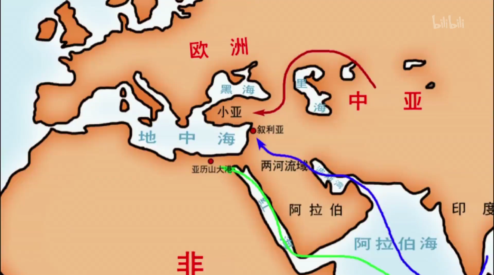
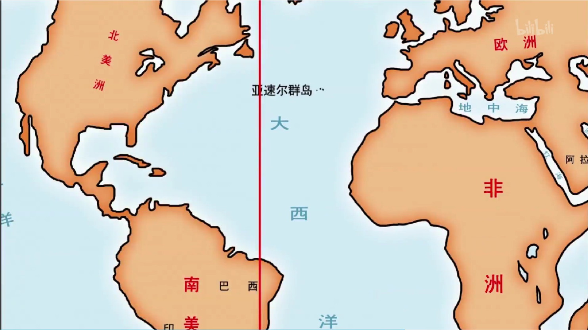

<iframe src="https://www.bilibili.com/bangumi/play/ep635236/" width="100%" style="max-width: 700px;" height="600px"></iframe>

### 哥伦布发现新大陆
- 南北美之间的岛被称为**西印度群岛**
- **亚美利加**证实美洲是新大陆，因此命名

### 非洲殖民
- 葡萄牙探险非洲西海岸
- 1471年，发现**加纳**沿海盛产金沙，称**黄金海岸**
- 1475年，发现象牙海岸
- **达伽马**绕过好望角，受伊斯兰国家指导，横穿印度洋。1498年到达印度

### 地理大发现动机
- 黄金Gold、上帝God、荣誉Glory
  - 15世纪欧洲由**银本位**转变为**金本位**，欧亚交易唯一方式是黄金
  - 欧洲黄金储量低
  - 《马可波罗行记》乱写
- 商路被拦截
  - 三条：绕过里海黑海到达小亚细亚、 由波斯湾到叙利、由红海到亚历山大港
  - **奥斯曼土耳其**横征暴敛，价格飙升10倍
- 被奥斯曼帝国刺激，急于传播基督教，寻找盟友

### 其他地理大发现
- 葡萄牙误打误撞发现巴西，发现太平洋
- 西班牙，麦哲伦完成环球航行

### 葡西矛盾
- 葡萄牙与西班牙产生矛盾
- 罗马教皇亚历山大六世以**亚速尔群岛**为界，西边给西班牙，东边给葡萄牙
- 两国签订《托德西里亚条约》
- **巴西**在分界线东北，因此是葡萄牙殖民地

### 葡萄牙殖民统治
- 50年贩卖15w黑奴
- 1510左右，占领莫桑比克作为据点
- 1506，占领红海门户，打败阿拉伯舰队
- 1510，在印度设立总督
- 1511，控制马六甲海峡
- 1533年，占领澳门

### 西班牙殖民统治
- 殖民之前，两大帝国：
  - 墨西哥 —— 阿兹特克帝国
  - 秘鲁 —— 印加帝国
  - 有文字、宗教，能建造神庙、陵墓、水利工程

:::note 随笔
有时真的怀疑当时欧洲人的世界观，为什么会对认知之外的地方这么感兴趣。我印象中的中国一直是固守中原，防蛮族入侵都来不及，没听说过主动探索南洋和东瀛，至少不像欧洲那样积极。

其实有一个逻辑历史课本和纪录片都没说清楚，就是文艺复兴激起人们追求财富的欲望，怎么就让他们干起抢劫的勾当？谈及追求财富，首先想到的不是加大生产吗，从别人抢来也算是追求财富的一种方式？
:::