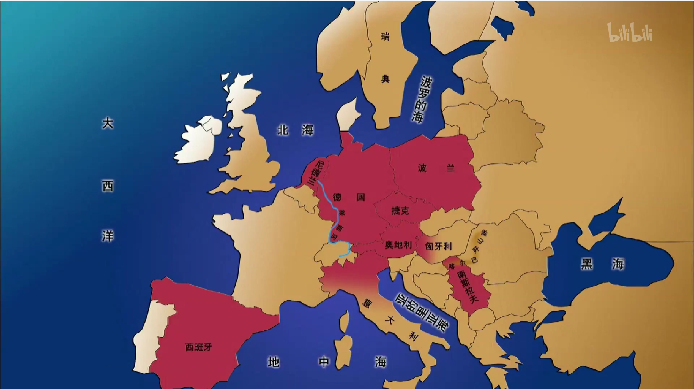
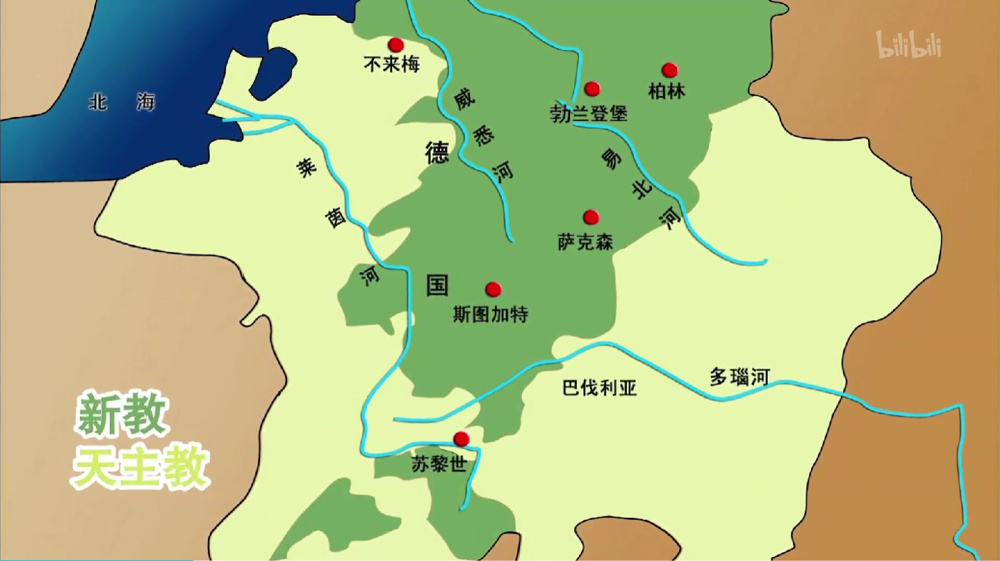

## [三十年战争](https://www.bilibili.com/bangumi/play/ep635239/)

<iframe src="https://www.bilibili.com/bangumi/play/ep635239/">

### 概述
- 1618 - 1648
- 欧洲第一场大规模国际战争
- 涉及大半个欧洲大陆
- 发源地、主要战场：德意志（**神圣罗马帝国**）

### 背景
- 1254年，神圣罗马帝国没有继承人，皇位虚悬
- 1273年，**哈布斯堡家族**的**鲁道夫**，西南部诸侯，获得皇位，开启**哈布斯堡王朝**
- 哈布斯堡家族控制了大半个欧洲
- 宗教改革导致德意志宗教分裂：天主教和新教
- 诸侯雄起，皇权削弱

### 起因
- 1618年，天主教徒、皇帝**斐迪南二世**，排挤**波西米亚**的新教徒公务员，关闭2座新教教堂
- 波西米亚是今天的**捷克**，彼时属于神圣罗马帝国
- 1618年，反叛者进入王宫捉住钦差，从20米高窗户扔下。是为**掷出窗外事件**
- 德意志地处中部，有很高战略地位。德意志内乱，全欧洲都想来搅屎：
  - 新教国家：英格兰、瑞典、丹麦、荷兰
  - 天主教国家：西班牙、波兰、罗马教皇
  - 法国是天主教国家，但是支持新教

### 波西米亚战争
- 德意志内战
- 新教同盟不团结、军队太年轻，战局对天主教有利
- 波西米亚回归哈布斯堡家族

  
### 丹麦战争
- 1625，法国首相提议与英国、荷兰、丹麦结成**反哈布斯堡同盟**
- **丹麦**以6万军队出兵德意志
- 1629年，丹麦失败，签订《吕贝克条约》
  
### 瑞典战争
- 丹麦失败，天主教同盟有向北蔓延趋势，**瑞典**惶惶不安
- 瑞典国王**古斯塔夫二世**向德意志发动战争
- 代表了这场战争的列强争霸属性
- 1630年，以4万军队登陆德意志
- 受法国、荷兰、俄国等援助长驱直入德意志中部
- 瑞典取得两次大胜，但是国王战死，此后难以构成威胁。

### 法国-哈布斯堡王朝战争
- 战局有扭转倾向，法国参战
- 代表着这场战争的宗教目的是虚伪的
- **西班牙**同属哈布斯堡家族阵容，1638年，法国向其宣战
- 法国受瑞典、荷兰、威尼斯、匈牙利等支持，波兰友好中立
- 西班牙被法国挡在门口
- 瑞典再次重创德意志皇帝
- 神圣罗马帝国投降

### 结果
- 签署 **《威斯特伐利亚合约》**，包含 **《奥斯纳布吕克条约》**和 **《明斯特条约》**
  - 承认新教和天主教平等，承认信教自由，宗教争端通过协商解决
- 法国建立霸权地位，瑞典成为北欧霸主
- 神圣罗马帝国
  - 瓦解为360+邦国，4w世俗领地，4w教会领地
  - 减少1/3人口
  - 社会倒退，农奴制复苏