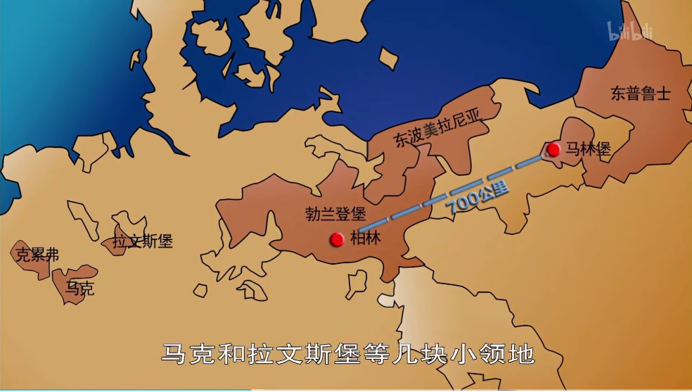
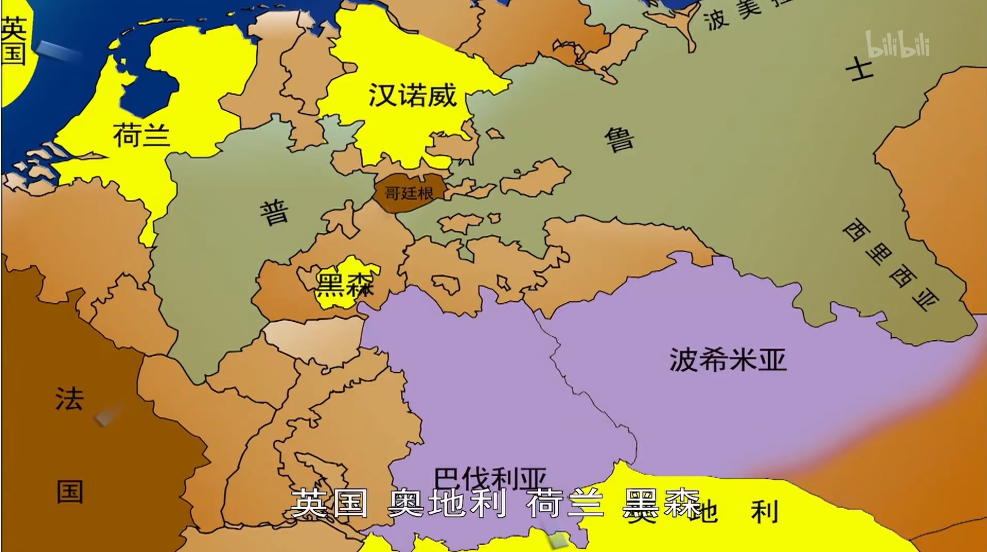

<iframe src="https://www.bilibili.com/bangumi/play/ep635290/" width="100%" style="max-width: 700px;"  height="600px"></iframe>

### 概述
- **1740** - **1748**
- 欧洲联姻普遍，因此争夺王位不是一个国家的事情，有时引发战争
- 奥地利王位继承战争相比于其他王朝战争的特别点在于主角：**哈布斯堡**王室，**神圣罗马帝国**的统治者
- 分为2次**西里西亚**战争
  - 属波西米亚
  - 富饶

### 背景
- 前车之鉴：1700年，西班牙绝嗣，被分割
- 1720，神圣罗马帝国皇帝**查理六世**，发布 **《国本诏书》**：
  - 奥地利世袭领地不可分割
  - 王位可由女性继承
  - 主要原因：查理六世独女
- 查理六世死后，《国本诏书》被轻视，玛丽亚特蕾西亚无人支持
- 贵族造反：
  - 巴伐利亚选帝侯、萨克森选帝侯
  - 娶前任皇帝之女为妻，argue说自己拥有继承权
- 其他国家势力：
  - 巴伐利亚选帝侯与**法国**勾结
  - **英国**跟法国对着干
- 支持奥地利：英国、荷兰、俄国、匈牙利、西里西亚、波西米亚
  - 英国只是看看，不想参战
- 反对奥地利：普鲁士、法国、巴伐利亚、萨克森、西班牙、萨丁

### 欧洲局势
- 老牌殖民帝国衰微：**葡萄牙**、**西班牙**
- **荷兰**在3次英荷战争后让位于英国
- **神圣罗马帝国**在三十年战争后分崩离析
- **哈布斯堡王朝**是帝国皇帝，实际控制地：奥地利、匈牙利、波西米亚（今捷克）以及国外领土，其他国家虎视眈眈
- 英法通过王位战争来抢领土

### 普鲁士
- 10世纪，瑞士北部山头领主**霍亨索伦**家族
- 1415，从**神圣罗马帝国**获得勃兰登堡领地和选帝侯称号
- 逐渐壮大
- 1618，从**波兰**得到**东普鲁士**
- 领地都是飞地
- 1701年，**腓特烈一世**获得**普鲁士国王**之称
- 腓特烈二世放弃雇佣军，改用本土军队；军队纪律严明。

### 第一次西里西亚战争
- 1740年，**普鲁士**打**西里西亚**，奥地利方军队全面溃败
- 《尼芬堡条约》：反奥地利军事同盟
- 1742，巴伐利亚选帝侯被选为罗马帝国皇帝——**查理七世**
- 奥地利节节败退，英国、荷兰、俄国只给钱不给人
- 特蕾西亚游说普鲁士：赠送西里西亚；普鲁士推出同盟，承认特蕾西亚。
- 特蕾西亚去匈牙利演讲，获得支持
- 奥地利开始翻盘：占领**巴伐利亚**、波西米亚、哥廷根，打败**法国**、**西班牙**，获得**萨丁**、**萨克森**的支持

### 第二次西里西亚战争
- **普鲁士**又跳反，打萨克森、波西米亚
- 奥地利打消耗战，还是输了
- 签订合约，奥地利承认西里西亚归普鲁士，普鲁士承认特蕾西亚
- 查理七世去世，特蕾西亚丈夫当皇帝

### 结果
- 奥地利的胜利是以割让领地换来的，实际上还是被瓜分了
- **普鲁士**日益强大：
  - **奥地利**因此与**法国**修好
  - **英国**支持普鲁士