::: tip 看论文要关注
1. **问题**:
   1. 不要只看作者描述的问题，往往包装得天花乱坠，要看他落地解决了哪些。
   2. 定位：同样是静态分析，有些是面向开发者的（针对源码分析），有一些是第三方、软件平台（无法获取源代码、针对二进制分析）
2. **假设**。看似结果很好，但是有很多前提条件。要发现文章隐含的假设就更难了。
3. **贡献**。一两句话的概括。
4. **方法/创新点**：
   1. 有些文章形式化写得很牛逼，一实现就很简单。此时的贡献就是形式化本身，而不是方法了。
   2. 要专注idea如何体现在效果上（评估、指标、落地解决了什么问题）。有用的idea才是好idea。有些文章最后实现的成品和方法是脱节的，看不出方法有什么用。
   3. motivation examples要仔细看。针对具体场景的方法都不是系统的，而是面向case的。看了case才知道为什么这么设计方法。
5. **实验**：无论方法如何炫酷，实验效果才是硬道理！复杂的方法未必能用，简单的方法反而能work。
   1. RQ、实验方法、数据集、指标
   2. 结果：一两句话描述。
:::

## 名词定义：一些摘抄
### 跨语言/多语言（Cross-Language/Multilingaul）
[broadening horizons](#broadening-horizons-of-multilingual-static-analysis-semantic-summary-extraction-from-c-code-for-jni-program-analysis):
> 多语言程序可以被分为**主语言**（host language）和**客语言**（guest language），主语言是提供FFI的一方，如JNI中的Java。两个通过外部函数接口（foreign function interface）交互，实现一个语言可以调用另外一个语言的函数并且交换数据。Python、Rust、Julia提供了语言级别的FFIs，Java和JavaScript提供了特定运行时环境的FFIs，如JNI和Node.js C++ addons。多语言程序可以利用不同语言的特性，对于开发者而言，利用多语言可以超过只用一种语言的表达能力。常见的是结合高阶语言和低阶语言。

[JN-SAF](#jn-saf-precise-and-efficient-ndkjni-aware-inter-language-static-analysis-framework-for-security-vetting-of-android-applications-with-native-code)
> 安卓允许开发者使用**native语言**来实现程序的一部分
> 
> **native code**

[Vulnerability Proneness](#on-the-vulnerability-proneness-of-multilingual-code)
> 研究表明**用多种语言来写软件**是主导的。
>

[Python/C](#a-multilanguage-static-analysis-of-python-programs-with-native-c-extensions)
> 多语言编程使得开发者可以复用其他语言写的库。

#### 我的定义：
共享同一个内存空间的程序用两种语言编写，并且两种语言编写的两个部分之间发生数据交换。

发生数据交换是分析的前提，没有数据交互的程序就是两个独立的程序，那么他们没有“跨”的成分，也没有研究的必要。

而共享同一个内存空间是对“跨语言”的细化。用两个语言编写的程序可以有多种交互方式，最简单的比如说多进程，主语言运行一个用另外一种语言编写的程序，两者通过输入输出交互、或着进程间通信。同理，服务器和网页代码通过网络通信，两种也是不同语言编写的。但是这种数据交换并不是底层的数据交换，一个程序对待另一个程序的数据就和其他任何外部的数据一样，并不涉及程序的语义。

### 跨语言分析（Cross-language Analysis）
[broadening horizons](#broadening-horizons-of-multilingual-static-analysis-semantic-summary-extraction-from-c-code-for-jni-program-analysis):
> 大多数静态分析针对一种语言，并且忽略了对外部函数的调用，因此产生不完整、不可靠的分析结果。WALA能够分析多种语言，但是不能分析由两种语言共同写成的程序。一些工作利用WALA能够分析用Java和JavaScript写的Android hybrid app。

[JN-SAF](#jn-saf-precise-and-efficient-ndkjni-aware-inter-language-static-analysis-framework-for-security-vetting-of-android-applications-with-native-code)
> 当**遇到native方法调用**，现有的数据流分析要么用保守的模型，要么忽略了native调用带来的副作用。
> 
> 设计一个可以**穿越语言边界跟踪数据流**的数据流分析是当务之急。

### 语言边界（Language Boundary）
[broadening horizons](#broadening-horizons-of-multilingual-static-analysis-semantic-summary-extraction-from-c-code-for-jni-program-analysis):
> 显式的语言边界：调用外部函数和调用本语言的函数有语法上的不同，如JNI中Java中声明外部函数会使用关键字`native`。Go把所有的C函数放到`C`模块里面。等等。
> 
> 隐式边界：把语言边界隐藏起来。如Python，调用C写成的模块与其他模块没有区别。

[Python/C](#a-multilanguage-static-analysis-of-python-programs-with-native-c-extensions)
> 主语言可以通过接口调用客语言，这个接口被称之为**语言边界**。

## 论文
:::warning TODO
补全所有论文的评估部分，尽量揭示其方法和评估之间的关联。
:::

### 静态
#### [Broadening horizons of multilingual static analysis: semantic summary extraction from C code for JNI program analysis](https://doi.org/10.1145/3324884.3416558)
:::warning TODO
补充：与[ilea](#ilea-inter-language-analysis-across-java-and-c)对比
:::

- ASE 20, Sungho Lee(Chungnam National University), Hyogun Lee(KAIST), Sukyoung Ryu(KAIST)
- **问题**：针对跨语言的静态分析仍然不足。一些静态分析工具直接忽略外部函数调用，一些工具能分析多种语言但不能同时分析，一些工具能够分析Android hybrid app但仅限于这种情况，不具备可扩展性。
- **贡献**：
  - 提出通用的多语言分析方法：对客语言进行模块化分析提取摘要，只保留互操作有关的信息；对主语言（提供FFI的一方，Java）采用全程序分析。主语言分析对客语言的语义无知，只知道FFI语义和客语言的摘要。
  - 对类C语言的语义摘要提出形式化抽象语义
  - 实现了JNI分析器
- **方法**：
  - 类C语言语法：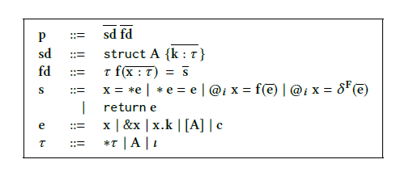 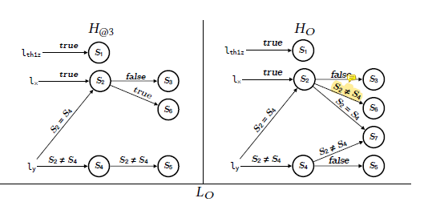
    - 5中statements：load、store、call、foreign call、return
    - 4中表达式：variable、variable reference、field access（返回地址）、struct creation、constant
    - 3种类型：pointer、struct、primitive。比如Java的对象`jobject`是primitive type。
  - 模块化分析客语言：对每个函数提取输入和输出状态之间的关系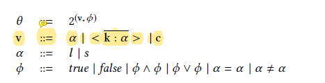 
    - 堆：地址（normal、symbolic） $\rightarrow$(value, constraint)。与其他抽象语义不同，这里没有变量和内存地址的区别，全都统一成地址，因为一个变量也是可以被指向的。
    - value：normal location（变量所在地址）、symbolic location、常量、结构体
    - constraint：在heap map中用来表示两个地址何时指向同一个值，假如指向同一个值就不用两个symbolic location来表示，指向一个symbolic location就好。这样做的好处是，可以流敏感分析。否则我们一开始就把它们看作两个symbolic location看待，……。
    - 输入状态包括：parameter enviroment X initial heap
    - 输出状态包括：final heap X foreign function call log。
    - parameter enviroment：一个参数指向一个symbolic location，假如参数是指针则symbolic location再指向一个symbolic location。
    - initial heap：两两讨论symbolic location是否相同，是就指向同一个。
    - foreign function call：callsites、返回值的symbolic location、实参变量、heap快照。这里的foreign function根本不是指在Java定义的方法，就是FFI。
  - 生成摘要：参数、语句、返回值
    - 语句：外部调用、分支、$\phi$
    - $\phi$：
  - 翻译摘要至主语言（bytecode）、插入代码
  - 主语言分析：
    - 给JNI建模，例如`GetObjectClass`、`GetMethodID`、`CallObjectMethod`。
  - 实现：
    - 摘要提取：Infer，C和C++的模块化分析框架。
    - Java分析：FlowDroid，基于Soot的Java/Android静态分析器
- 两种bugs：
  - 错误调用外部函数：或运行时错误或未定义行为。本文能够检查错误的绑定和错误的C调用Java方法。
  - 错误处理Java异常：

#### [Towards Understanding and Reasoning About Android Interoperations](https://ieeexplore.ieee.org/document/8811927/)
- ICSE 19, Sora Bae(KAIST), Sungho Lee(KAIST), Sukyoung Ryu(KAIST)
- 贡献：
    - Android官方对Javascript和Java之间互操作的一些行为语焉不详，本文通过对安卓应用的测试、检查，观察到一些行为，提取作为互操作语义
    - 本文在形式化描述互操作时体现两个特性：动态、不可区分。动态：JS对Java对象的访问是动态的；不可区分：Java对JS来说是透明的。
    - 创造一个检查器，比HybridDroid快15倍。

:::info Android Hybrid App
为了实现跨平台以及克服浏览器的局限性，应用纷纷内置了“浏览器”，跨平台框架（Flutter、Reacti Native，Ironic，Cordova）。核心功能用javascript、css、html实现，但是框架提供插件使得hybrid app的能力比web app更强，能方便使用、访问平台（iOS，Android）和设备。
:::

#### [A Multilanguage Static Analysis of Python Programs with Native C Extensions](https://link.springer.com/10.1007/978-3-030-88806-0_16)
- SAS 21, Raphaël Monat, Abdelraouf Ouadjaout, Antoine Miné(Sorbonne Université)
- 问题：Python代码往往依赖native C代码。目前分析方法用stub来给C代码建模，但是要么耗时要么不准确。Python和C交互可能带来的问题：C没有异常处理；Python和C得数据表示不同，C存在溢出问题但Python对此无知。
- 贡献：
  - 设计了Python/C的语义
  - 提出了Python/C跨语言的流敏感、上下文敏感数据流分析，Python和C共享地址和数值抽象。
  - 基于Mopsa现成的Python和C分析工具，检测C和Python的运行时错误
    - C：无效内存访问、整型溢出
    - Python: AttributeError, TypeError, ValueError, SystemError
- 本文不采用自底向上地构建summary的方法，声称：
  - 分析动态类型语言不用上下文敏感很难讲分析得精确。*（这和动态类型有关吗？）*
  - 上下文敏感分析很难自底向上地分析。*（为啥？）*
  - C代码对Python堆已知是有必要的，方便检查指针错误，和分析副作用。
- 一些Python/C常见的[bug patterns](#the-pythonc-api-evolution-usage-statistics-and-bug-patterns)：
  - 返回null但是没有设置exception flag。
  - Python/C 数据类型转换错误（`PArg_ParseTuple`、`PyLong_FromLong`）
  - Python整型转换C整型导致溢出。
  - 引用计数错误（本文不解决）
- Python/C具体语义：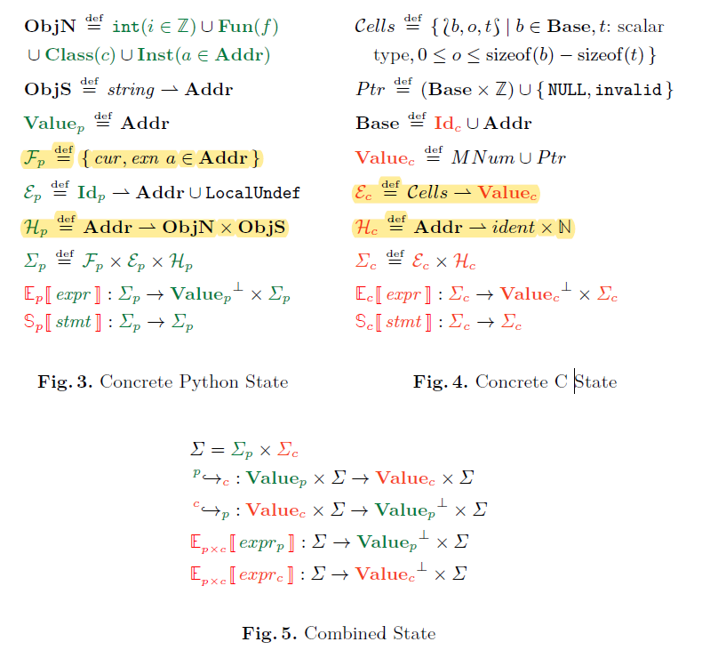
  - 假设：在C中，Python内建的对象只能通过API访问。C用API访问内建对象视作回调Python函数，也就是现在Python端读取，再使用某种Python $\rightarrow$ C转换语义。
  - Python状态：
    - 一切皆对象；
    - 堆：地址$\rightarrow$对象
    - 环境：变量$\rightarrow$地址。
  - **地址Addr**和**数字Numeric**在Python和C之间**共享**。
  - C状态：
    - 数据可以在堆中，也可以在栈中，用结构体表示。Cells是结构体成员，Base就是数据的基地址。
    - 指针不只是堆地址，还可以偏移。
    - 环境：每一个成员$\rightarrow$值
    - 堆：标识申请内存有多大，数据是C内部（malloc）的还是Python（PyAlloc）的。C和Python共享Addr。
    - 对于Python对象，存在两个视角：Python视角下一个对象有基本类型（函数、类、实例、内建）以及它们的域；在C视角下，Python对象有成员。
  - boundary function：在Python对象的不同视角之间进行转换。Python对象同时在C和Python中被表示，如何把一边的表示翻译成另一边的表示。这种转换是抽象的，并不是具体的程序行为。
    - Python$\rightarrow$C：先翻译对象的类型（也是一个对象），然后在C堆中把Python对象（表示为一个地址）标记为`PyAlloc`大小为`PyObjectSize`。
    - C$\rightarrow$Python：也是递归地翻译`ob_type`为Python对象，以这个对象为类型
    - *在C中使用PyAlloc创建Python对象？函数对象怎么办，怎么对应到C函数？类对象怎么办，在C中给类注册方法怎么实现？*
  - Call：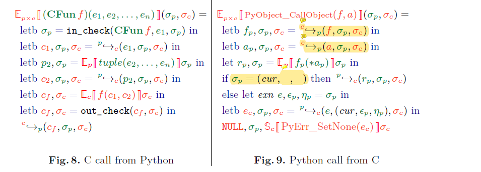
    - C$\rightarrow$Python：函数就是C形式。检查第一个参数是否匹配函数绑定的类型；打包参数、翻译参数Python$\rightarrow$C；检查返回值是不是NULL，翻译返回值。
    - Python$\rightarrow$C：函数是C中的Python对象。翻译函数，翻译参数，在Python语义中调用。等等。
    - *C函数怎么在Python中表示？CFunc哪来的？*
  - 异常C$\rightarrow$Python：在C中，调用`PyErr_SetNone`，
  - builtin value转换: 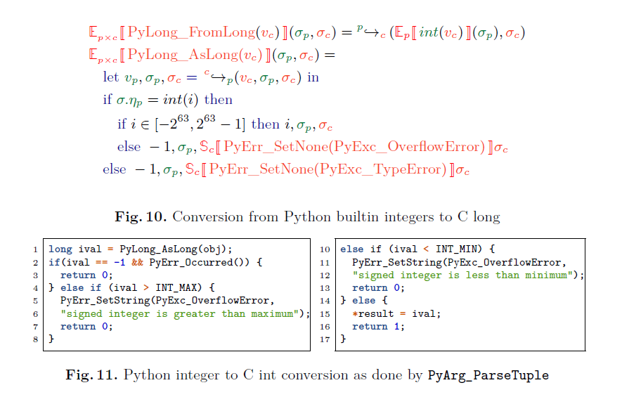
    - Long Python$\rightarrow$C: `PyLong_AsLong`把C中Python int对象转换为C int。方法为先翻译C中Python对象为Python表示，检查类型，检查取值，直接获取取值。
    - Long C$\rightarrow$Python: `PyLong_FromLong`C int转换为C中的Python int对象。方式为在Python语义中调用`int(...)`，再翻译为C。
    - 转换都是在C的语义下完成的，因为binding code就是用C写的。这个转换有具体的转换行为（代码中调用一个Python转换API）,将C int转换为Python对象。
- 抽象语义：把上述的Number和Addr换成抽象表示。Number可以换成interval abstraction、octagon abstraction。Addr可以换成callsite、recency。
- 实验中，用“选择性”来展现他们工具的能力：工具计算的安全操作数/动态检查的数量。

#### [Bilingual Problems: Studying the Security Risks Incurred by Native Extensions in Scripting Languages](https://www.semanticscholar.org/paper/Bilingual-Problems%3A-Studying-the-Security-Risks-by-Staicu-Rahaman/681c9dac27366e20aa84fdb4992177dcf2aba9a2)
- arXiv 2021, USENIX Security 2023, Cristian-Alexandru Staicu, Ágnes Kiss, Michael Backes(CISPA), Sazzadur Rahaman(U~ of Arizona)
- **问题**：Python、Javscript、Ruby都允许用其他语言来写extension，而写extension的人可能会犯错，引入一些漏洞。
- **贡献**：
  1. 总结了一些misuse模式
  2. 设计一个工具检查这些misuse，用于Node.js和npm上的包
- 几种错误：
  - 没有处理异常，导致crash
  - 参数翻译，假如参数类型不对，两种native api的处理还不同：或返回error code，或直接忽略；`\0`表示字符串的终结？
  - 缺少返回值，但是又尝试读取返回值会hard crash。
  - 调用C extension是同步的，可能会阻塞Node.js
  - 内存管理问题：缓冲区溢出，释放后使用、重复释放。
:::info Node.js API
1. Node.js addons开发早期用的是Node.js、v8提供的开发头文件。然而由于这两家更新频率很快，使得开发者叫苦不迭。
2. Native Abstractions for Node.js（NAN），用宏封装了上述头文件。Nan可以用宏自动判断版本，自动展开成相应的接口，使得API独立于Node.js版本。虽然源代码相同，但依然需要针对不同版本的Node.js进行编译，因此所有的二进制代码很多。而且只能用于v8引擎。
3. Node API（N-API）是Node.js基于C设计的API，用于摆脱对JS引擎的依赖。N-API包含了ABI（因为支持JIT，跨语言调用需要用ABI统一），ABI在大版本中保持稳定，不需要重新编译。node-addons-api在此之上提供C++封装。
:::
- **方法**：
  - 对JavaScript和C分别提取他们的过程内数据流。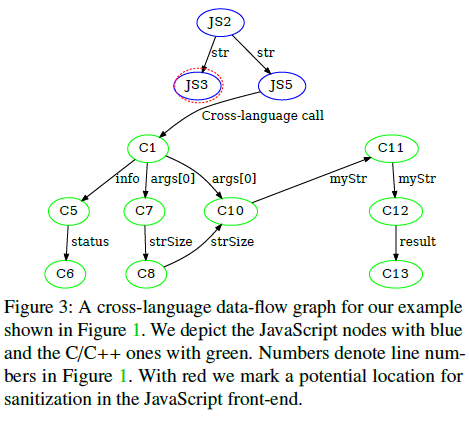
  - 连接数据流：找到名字对，C函数名和在JavaScript中的名字。根据下面的语法模式（各种脚本语言extension用来注册API的方法）。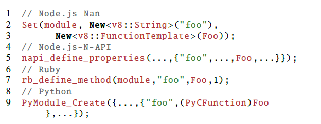
  - 对于他们要找的每个漏洞，指定一个sink节点，然后分析从JavaScript的entry node到sink node之间的路径有无sanitizer，有则安全，无则报警。

  - 他们也推广到过程间分析。他们利用现成的调用图，从上述的vulnerable function开始倒推，用后向数据分析来做def-use分析。
- **实现**:
  - 数据流图：Joern来分析C/C++、Google Closure Compiler来分析JavaScript。
- 和[binding](#finding-and-preventing-bugs-in-javascript-bindings)类似，这篇论文偏安全方向，里面提到了很多跨语言交互的一些细节，但是他们是把它当作一个个可能存在的漏洞提出来的，而不是建立全面的semantic来描述这些行为。感觉有些琐碎了。

#### [Finding and Preventing Bugs in JavaScript Bindings](https://ieeexplore.ieee.org/stampPDF/getPDF.jsp?tp=&arnumber=7958598&ref=&tag=1)
- SP 17
- 问题：一些Javascript的底层和addon是用C++实现的，写的时候需要用binding code来粘合javascript和C++，翻译数据类型、数据表示、传递异常处理等。binding code容易程序员编写，容易写错，导致：crash、跳过类型、边界检查。binding code可以调用javascript代码。使之更容易被劫持。
- 贡献：
  - 总结了三种安全的违反（bug）：crash-safety、type-safety、memory-safety。
  - 提出检查器来发现上面三种bug，支持多个runtime：nodejs、chrome blink、chrome extension、pdfium。*但应该是面向v8引擎分析*
  - 把v8引擎api包装成安全的api
- 本文是安全方向的论文，因此在提及bug的时候总是强调它们是exploitable的或者可能导致什么后果。
- bugs:
  - crash-safety: 发生硬crash
  - type-safety：没有检查类型就使用或者转换
  - memory-safety：内存访问错误，如数组越界。挑战在于binding code回调javascript函数可能会改变数组长度。
- Checker：
  - 用[microchex](https://cseweb.ucsd.edu/~dstefan/cse291-fall16/notes/uchex/)（他们组16年的工作）语法检查器来发现bug。这个工具接受小语法（编程语言语法的一部分），这个小语法以某个特定的分析为导向编写（如空指针分析，那么小语法专注于发现指针解引用和指针赋值）。这个分析是path-sensitive的。这个工具无法进行过程间分析，无法进行别名分析。 
  - *本质上与其他静态分析没区别，别的静态分析基于AST，它的静态分析基于化简的语法树，边扫描便分析。*
  - Hard Crash bugs：
    - assertion：假如ASSERT、CHECK里面是来自javascript的变量就报错。
    - unsafe-conversion：。。。
  - type safety：收集没有经过类型检查的参数，假如cast了就报错。
  - memory-safety：
    - 依赖隐式转换的内存操作：隐式转换指的是可能隐式地调用`Symbol.toPrimitive`的方法，如`UInt32()`。假如一个值是通过隐式转换得到，则称之为危险值。若危险值出现在`malloc`、`memcpy`就报错。（隐式转换可能被劫持，这样数组长度会改变，内存操作就危险了。但是为啥一定是危险值作内存操作的参数才报错呢？莫名其妙）
    - PDFium use-after-frees：凡是调用了javascript的函数就认为当前所有指针是可能被free的。
- 这篇论文只面向binding code进行分析，我觉得并没有“跨语言”，本质上仍是C++程序分析。但本文确实有关跨语言，那3种bugs就是跨语言场景下才存在的bug，所以这是在跨语言场景下对C++进行分析。而且这里的bug并不是指运行时出错，而是我可以手动创造条件（自己编写javascript代码）来触发，所以分析得更加保守。我觉得这篇论文一般。

#### [Ilea: inter-language analysis across java and c](https://dl.acm.org/doi/10.1145/1297105.1297031)

- OOPSLA 07, Gang Tan (Boston College), Greg Morrisett (Harvard U~)
- **问题**：之前的静态程序分析限定在一个语言中，但是Java中JNI的使用还是很多的。
- 如何给C做规约（如何描述C代码的行为）
  - 做标记：不合适
    - 标记有无副作用、nullable甚至数据流值
    - 过于ad-hoc，不具备可扩展性。
  - 本文用霍尔逻辑：描述C代码，捕捉运行前-运行后的关系：返回值与参数、运行前的Java堆-运行后的Java堆，抛弃C的执行步骤和C的堆。
- Extended JVML：模拟C对Java堆的影响，引入不确定性
  - choose $\tau$：返回$\tau$类型的随机值。当$\tau$是类，表示随机一个现有的对象。可用来模拟系统调用结果，和over-approximate。
  - mutate x：修改一个对象为随机的值
  - top：或修改或分配Java堆 
- **方法**：为了同时分析Java和C，他们选择把C代码翻译成Java虚拟机语言（Extended JVML）。
  - 类型映射：
    - 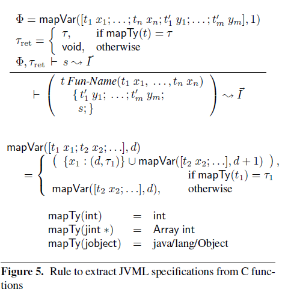
    - 指针映射成void；指针类型变量直接丢弃。
  - 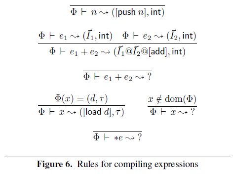
    - ‘?’翻译成choose
  - JNI API翻译：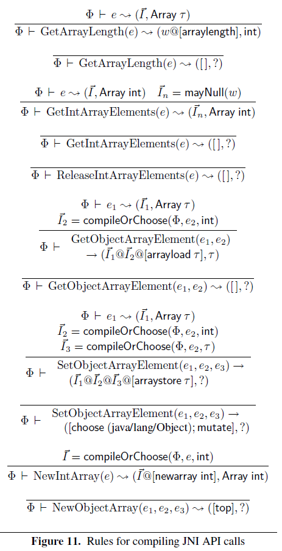
- **实现**：
  - CIL 

#### [Operational Semantics for Multi-Language Programs](https://dl.acm.org/doi/10.1145/1190216.1190220)
- POPL 07, Jacob Matthews (U~ of Chicago), Robert Bruce Findler
- 背景：foreign functions既包括高阶安全语言调用低阶不安全语言(如Java与C)，也包括高阶安全语言调用其他高阶安全语言（Python和Scheme）。前面的研究着眼于如何实现这种交互，在比特的层面解决交互的问题，缺少对多语言程序形式化推理的工作。
- 贡献：
  - 本文提出ML和Scheme的多语言操作语义。
  - 可以用来证明type soundness和上下文一致性
  - 基于boundaries：可以把控制流和数据在两种语言中转换
- 肿块嵌入：两种语言可以看到对方的值，但是不能使用，只能把它返回给对方
  - 简单容易实现
  - 符合一些多语言系统：Haskell给C程序一个指针，C只能返回不能取值来用。
  - 引入语法的边界：先写出两个语言的语法展开式，然后加入转换操作（相当于一种运算、一种表达式）：把一个语言非终结符可以由另一个语言的非终结符用转换操作得到。这个转换仅仅只是语法上的转换，并无实际含义。（M表示ML、S表示Scheme，靠近哪边表示哪边是什么语言）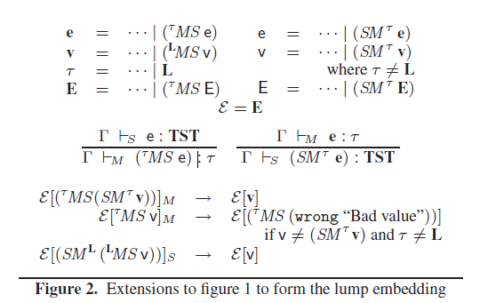
  - 统一类型系统：Scheme是无类型的，为了实现统一的类型系统以及肿块（禁止访问对方语言的数据），
    - 给Scheme添加TST类型，表示Scheme自己的类型；L表示Scheme在ML中的类型；ML在Scheme中的类型就是TST。
    - 归约规则对对方的类型无知。Scheme->ML：Scheme类型都是TST。转换成ML后的类型取决于这个数据怎么来的，假如是Scheme内部的数据就是L；假如是ML传进去又返回出来的数据，就保留原来的类型$\tau$。
    - 肿块体现在：**没有把SM(n)、MS(n)变成n的规则,也没有把SM(λx.e)/MS(λx.e)变为...的规则**，因此没法参与运算（+/-），没法apply。这就像一个tag一样一直跟随着v进行规约（if，λ），直到遇到相反的转换操作。简而言之，**无法将一个语言的数据类型转换为另一个语言的数据类型，如string->char[]**
 - 简单自然嵌入：在肿块嵌入的基础上添加数据类型的转换
   - 对于数字，添加相应的转换操作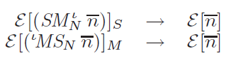
   - 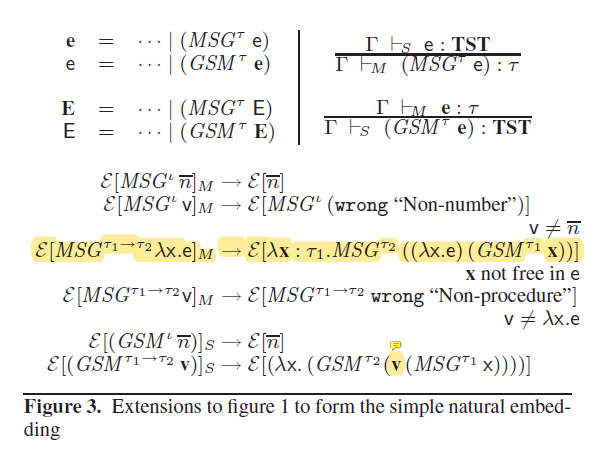
   - 无类型Scheme -> 有类型ML：类型任意。动态检查是否搞错number/function
     - number/function搞错=>立即报错；
   - Scheme函数->ML函数：包装成ML函数，任意函数类型。函数体是把参数M->S后，在Scheme的上下文中调用Scheme函数，把返回值S->M（同上，类型任意）。
     - 参数类型搞错=>Scheme内部报错；
     - 返回值number/function搞错=>立即报错；
     - 返回值是函数，但是具体类型搞错=>下次再说；
     - type safety要求程序never goes wrong（卡住或者未定义）。而添加error状态后的Scheme是不会stuck的。
   - ML函数->Scheme函数：包装成Scheme函数。函数体中先S->M翻译参数，可能报错，然后在ML上下文调用函数，然后M->S翻译返回值。
   - 检查然后报错被称为**guard**，说白了就是动态类型检查。静态类型语言不会进行动态类型检查，而无类型的就会。要让ML使用Scheme的函数，就要添加动态类型检查机制。而Scheme用ML的就不需要，因为它本来就有动态类型检查。ML在使用Scheme数据要用动态类型检查，这个检查只区分number还是function是因为：
     - 可行，number和函数在语法构造上（语法不要理解为静态的代码，而是运行时程序的抽象表示！）不同，可以写成归约规则。而函数类型是无穷的，所以没法针对每一种函数类型进行转换。由此类推，若数据是个无类型对象，也是无法检查的。（也就是检查）
     - 没有必要进一步区分。ML其实不在乎Scheme函数的类型，只担心从Scheme的基本数据类型，因此只要对返回值进行类型检查即可。
     - 由此可见，不区分number和function也是可行的，推迟到使用时再检查有何不可？对于加法，我检查操作数是不是Scheme的数字，此时再报错。但是：
       - 推迟了不好，不好溯源。明明可检查干嘛不检查。
       - ML作为静态类型语言，却让动态类型检查分布到整个程序。
- Guard分离嵌入：在自然嵌入的基础上，在Scheme一侧引入Guard操作。Guard不进行转换，只进行检查。因此转换操作只需无脑转即可。假如一个数据没有经过guard就转换，会卡住。 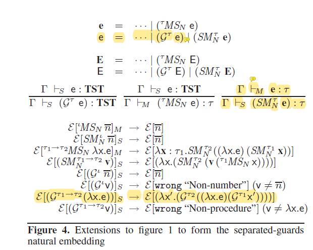
  - 要求程序一开始时必须形如：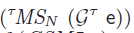  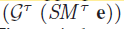 由此来保证type soundess。
  - 在ML调用Scheme的函数，为什么要检查参数？简单自然嵌入中 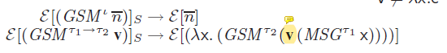 $GSM$不会检查x是不是数字啊？
  - 但若参数x传递一个函数λx.e，t1=t3 \rightarrow t4。GSM要翻译成$λx. GSM^{τ2}(v MSG^{τ1} x)$。也就是带动态检查的Scheme函数，在检查给ML的参数。
  - $G^t$有两个功能：检查它是函数还是number；对于函数还生成带有检查的封装函数：Guard返回值和Guard参数。假如这个参数有朝一日传进来一个ML函数，G参数会再生成一个封装函数：也是Guard参数、Guard返回值。此时Guard参数就是必要的，因为这是传给ML函数的。
  - 对于$G^{(t1 \rightarrow t2) \rightarrow t3}$，不仅检查返回值t3，还要检查参数t1->t2。进一步的，有朝一日，检查参数t1->t2的时候，要检查参数的参数t1，这个参数是要传递给ML的。
  - 分离嵌入和简单嵌入其实是等价的。因为要求初始程序G和SM/MS必须成对出现，而G和SM/MS都是对函数的作用都是生成一个带封装的函数：$G^t·SM^t(λx.e) \implies G^t·SM^t (λx.e\ SM^t·G^t)$。不同在于：这里的G并不根据当前的SM/MS来选择性检查；但是GSM不会检查，MSG才检查；
- contract嵌入：把转换和检查分离后，可以看到一些冗余的检查。对于$MS·G^{int \rightarrow t}$，检查参数是不必要的。对于$G^{t \rightarrow int}·SM$来说，检查返回值也是不必要的。本来ML->Scheme的基本数据类型都不需要检查，怕的是传递ML的函数！
  - 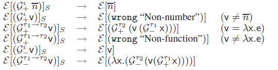
  - $G_+^t$：
    - 判断是不是number/function，报错； 加封装。
    - 用于Scheme->ML：总是判断类型、报错；对于函数，还生成带检查的封装，但是对返回值用$G_+^t2$，对参数用$G_-^t1$，因为参数的方向是ML->Scheme！
  - $G_-^t$：
    - 不会报错，只会加封装。
    - 对于t=int，它是哑的：既不报错，也不生成封装函数。
    - 用于ML->Scheme。
  - 和简单嵌入一样的事：检查和转换不分家，该检查时才检查。
- 他们证明自然嵌入是可以写成肿块嵌入的。*没看明白*。
- 异常处理：ML异常处理，Scheme有try-catch
  - 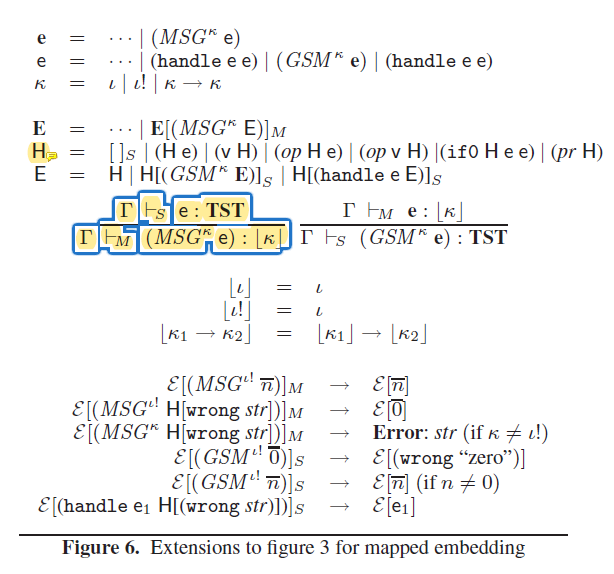
  - 拓展类型到$\Kappa$。加入$\lota !$，表示用成功/异常当返回值（数字）。这个类型只出现在转换中，不会出现在ML的类型系统中。扩展的类型不仅指定了转换API要转换成什么类型，也指定了怎么（在ML中）处理（Scheme的）异常。
  - Scheme的上下文分为H和E，H表示没有异常处理的上下文，E表示所有上下文。这使得Scheme无法处理由ML返回的异常（当返回值为0）。
   
#### [JuCify: a step towards Android code unification for enhanced static analysis](https://dl.acm.org/doi/10.1145/3510003.3512766)

:::warning TODO
与[semantic extraction](#broadening-horizons-of-multilingual-static-analysis-semantic-summary-extraction-from-c-code-for-jni-program-analysis)对比
:::

- ICSE 2022
- **问题**：恶意软件可能在Android的native code里面。当前分析native code的方法是临时的，对bytecode和native code的分开分析，然后再把结果统合在一起 *（JN-SAF？DroidNative？NativeGuard？TaintArt？）*，缺少统一模型。
- **贡献**：
  - Jucify：生成包含native代码的统一Jimple表示。
  - Jucify直接在**二进制层面**进行分析：bytecode和native binaries。
- 生成统一的调用图：
  1. 构建native callgraph。用ANGR，二进制分析工具。
  2. 提取双向的调用信息。
     1. 提取bytecode方法类型、签名。ANDROGUARD。
     2. 提取entry方法（用`native`声明的方法）的调用。entry方法是指native函数被bytecode调用。
     3. 把entry方法（bytecode）和entry函数（native）匹配起来。既包含静态注册（函数名满足命名规范）和动态注册（符号执行）。
     4. 提取exit方法调用。exit方法是指bytecode的方法被native调用。这里是获取entry-exit对，从entry函数开始符号执行，从二进制码中（ARM）找到函数调用和返回，模拟函数调用。
  3. 修剪native callgraph，保留从entry可达的部分。把它转换为soot形式。
  4. 利用native-bytecode（host language）相互调用的信息联合两边的callgraph。
- 用Jimple来表示bytecode和native code
  - 用DummyBinaryClass来表示native代码，native函数就是它的方法。
  - bytecode对entry method的调用改成对DummyBinaryClass方法的调用。
  - native code转Jimple是围绕返回值和exit调用的。抛弃了数据流图，排列组合来枚举exit参数和返回值。在函数签名的参数声明、可以推导的其他变量（exit方法返回值的结果变量，调用exit方法的接收对象等）枚举。保守估计。
  - 本质上是对native代码建模，但是相当粗糙。
    
#### [JN-SAF: Precise and Efficient NDK/JNI-aware Inter-language Static Analysis Framework for Security Vetting of Android Applications with Native Code](https://dl.acm.org/doi/10.1145/3243734.3243835)
- CCS 18, Fengguo Wei, Xinming Ou(U~ of South Florida), Xingwei Lin, Ting Chen, Xiaosong Zhang(U~ of Electronic Science and Technology of China)
- **问题**：Android的native code有安全隐患，可能泄漏敏感信息或者利用漏洞。缺乏语言间的数据流分析。
- **贡献**：
  - 基于摘要、自底向上数据流分析
  - 统一的堆操作
  - 给Native Develpment Kit（NDK）、JNI建模，让二进制分析工具能够分析native code。
  - 这里的native code是**二进制层面**的。
  - JN-SAF：跨语言数据流跟踪，能够找到跨语言安全问题。
- **背景**：
  - Native Development Kit（NDK）：android允许开发者使用NDK用C/C++编写组件，运行时直接调用native代码中的生命周期方法。基于JNI。
  - 两种native Activity：
- **Motivation Examples**
  - 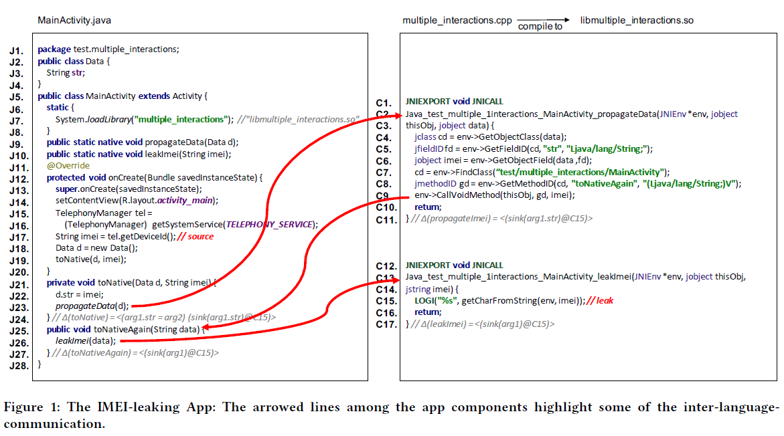
  - native code可能回调java方法
- **方法**
  - 基于摘要自底向上分析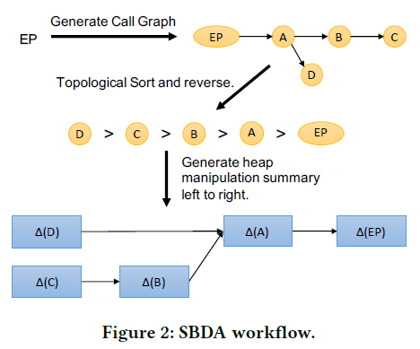
    - 摘要：
    - 摘要描述的是**Java对象**
    - LOC：代码位置
    - HeapLoc：参数、返回、变量的成员（下标）
    - assign：对HeapLoc强更新、弱更新、删除
    - action：在某个代码点对某个HeapLoc、Instance删除堆、标记为source/sink
  - 解析动态注册（在二进制中）：
    - 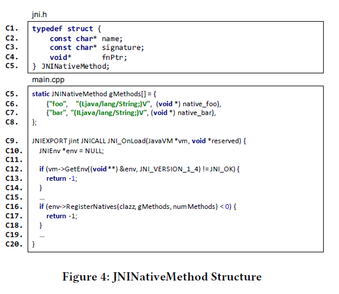
    - 从`JNI_OnLoad`开始符号执行
    - 对`vm`、`GetEnv`、`RegisterNatives`建模，并且在`RegisterNatives`中获取`gMethods`数组的地址
  1. 反编译：把bytecode反编译成Pilar，用angr反编译二进制成VEX
  2. 用Amandroid构建环境模型。Android是基于事件的系统，没有入口。
  3. 基于摘要的数据流分析
     1. 构建调用图。调用图是双向的。
     2. 自底向上摘要传播
     3. 用Amandroid做Java数据流分析
     4. 用angr的符号分析的标注功能做C数据流分析
      - 对JNI函数建模，在创建/操作Java对象时修改summary标注
      - 把所有的Linux系统调用、JNI回调API标注为污点源、汇（哪些是源？）
- **评估**
  - 数据：
    - NativeFlowBench：22个benchmark
    - AndroZoo中100000个app
    - AMD数据集中24553恶意app
  - 与baseline在NativeFlowBench比较，看能够报告数据泄漏路径
  - 在real world projects讨论了4个case
       
#### [On the Vulnerability Proneness of Multilingual Code](https://doi.org/10.1145/3540250.3549173)
:::warning TODO
补全方法
:::

- ESEC/FSE 22, Wen Li, Haipeng Cai(Washington State U~), Li Li(Monash U~)
- **概述**：本文是对多语言项目的实证研究，旨在发现多语言的脆弱（proneness to vulnerability）和语言选择的关系。他们发现和语言边界的接口有很大关系。

#### [Cross-language Android permission specification](https://dl.acm.org/doi/10.1145/3540250.3549142)
- ESEC/FSE 22, Chaoran Li, Sheng Wen, 
Yang Xiang(Swinburne U~ of Technology), Xiao Chen(Monash U~), Ruoxi Sun(The U~ of Adelaide), Minhui Xue, Muhammad Ejaz Ahmed, Seyit Camtepe(CSIRO’s Data61)
- **问题**：Android一些敏感API会要求权限，但是官方没有给出这样的清单说什么API会请求什么权限。已经有研究者扫描API框架给出这样的映射，但是对native library（C/C++）却没有。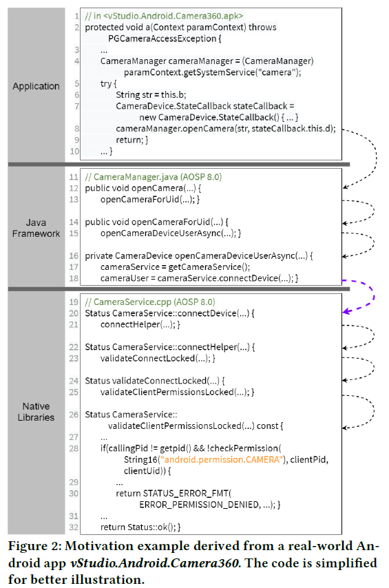
- **贡献**：
  - NatiDroid：跨语言**控制流**分析
  - 提取API-permissinos映射，分析“过度提权”漏洞。
- **背景**：
  - Android的java/C++交互模型
    - AIDL：IPC，c/s
    - JNI
- **方法**：
  - 生成中间代码（.jar、Clang Complie commands）
  - 结合跨语言API，识别入口对：语法分析
  - 构建跨语言控制流图
    - C：前向分析，只保留安全检查的图（权限检查、uid/pid检查）
    - Java：从语言边界反向到最外层API（API可能调用API）
  - 提取映射
- 实现
  - 基于SOOT和CLANG分析框架
- **评估**：

#### [Finding Reference-Counting Errors in Python/C Programs with Affine Analysis](http://link.springer.com/10.1007/978-3-662-44202-9_4)
- ECOOP 2014, Siliang Li, Gang Tan(Lehigh U~)
- **问题**：Python运行时无法管理native模块对Python对象的引用，native模块需要手动修改引用计数。
- **贡献**：
  - Pungi：用静态分析来识别Python native C模块中的引用计数错误。
    - 只分析C代码
  - 对native模块仿射抽象（affine abstraction）得到仿射程序：赋值右手边只能是仿射表达式（$a_0+\sum_{i=1}^na_ix_i$）。
- 本文不算做跨语言分析，因为它没有处理语言边界问题，但是这是一个在跨语言场景下的程序分析问题。
- **背景**：
  - 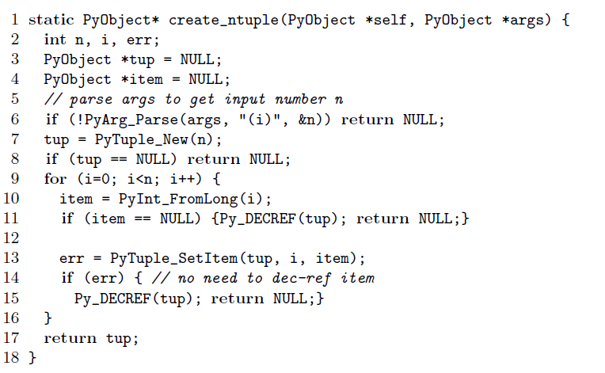
  - 借引用：
    - 获得一个对象的引用但是不增加引用计数。
    - 根据Python/C manual，当你知道其他其他引用活得比这个变量久，那就别增加计数。
    - 从caller的参数借：caller的生命周期肯定比callee长
    - 从特定API的返回值借：特定API的行为如此，如`PyList_GetItem`。在借这种引用，需要保证你活得比别人短。*假如API加了一层封装，它的返回值？*
  - 偷引用：指API的行为，API的借叫做偷，如`PyList_SetItem`
    - API从caller获得一个对象的引用，但是不增加引用计数；获取失败反而会减少引用计数。
    - 表现为从caller的变量偷走引用，该变量的引用视为无效。
  - 成功创建对象时，引用计数为1。
- **方法**：
  - 对象的引用逃逸出作用域：被返回、传递给全局变量、传递给堆、被偷走
  - 以object scope为单位分析，而不是所有程序点。
    - 因为借/偷，不是所有引用都会被计数。粗粒度有利于减少FP。
    - 对象分为natively创建的和Python创建的
      - natively创建的对象的scope是创建点所在函数
      - Python创建的对象的scope是入口函数
    - 一个object在其scope内的引用计数变化等于逃逸数。
    - *看起来object scope提出的意义就在于区分entry function和创建对象的函数。*
  1. 分离接口和库
  2. 翻译成SSA
  3. 仿射翻译
    - 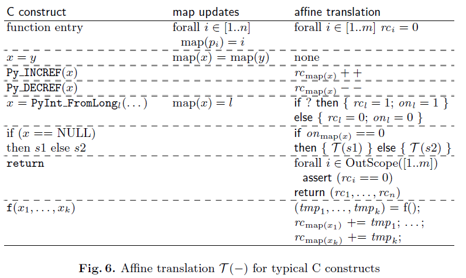
    - 先假设每个参数分别指向不同对象
    - 维护变量-对象映射 
    - 变量都是$rc_i, on_i$，$on_i$指示成功创建对象。这是关于reference counter的程序，所以才是仿射的
- **实现**
  - OCaml
- **评估**  
  - 13个real world项目
  - 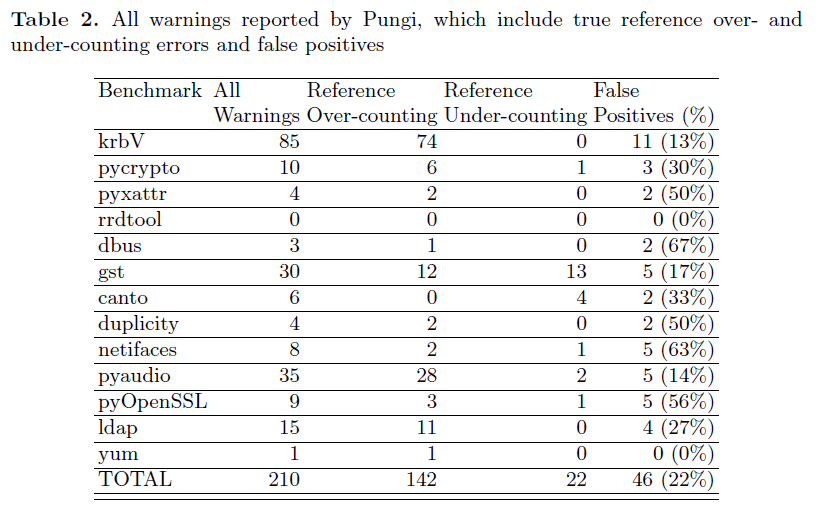
  - 人工审查所有errors

#### [Exception analysis in the Java Native Interface](https://www.sciencedirect.com/science/article/pii/S0167642314000446)
- SCP 2014, SiliangLi, GangTan
- **问题**：由于语言机制的不同，多语言编程是易错的。本文研究的是JNI中的Java/C的异常处理机制，希望找到JNI中异常处理相关bugs。
- **背景知识**：
  - native方法可以抛出异常：
    - 通过api
    - 隐式抛出？
    - 回调Java方法，该方法抛出异常，该异常在native侧是“待发”的。
  - 当native代码抛出异常，要等到native代码结束才会打断执行流。
  - native代码可以用`ExceptionClear`处理异常。
- 两种bug：
  - native代码声明的异常和实际抛出的异常不一致。
  - native代码错误处理异常：当JNI异常是待发的，但是接下来的操作是不安全的。
    - 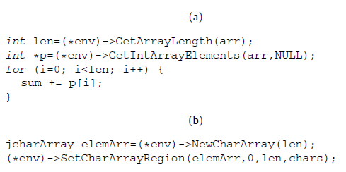
    - （a）`GetIntArrayElements`抛出异常返回空指针，后续解引用异常
    - （b）在抛出异常后调用其他JNI函数
- **贡献**：
  - TurboJet，静态分析JNI程序，查找异常声明和实现的不一致
- **方法**：
  - 输入：Java class + native code；输出：警报。
  - 删除无关代码：与JNI无关的库代码
  - 细粒度分析：上下文敏感、路径敏感
    - 有限状态机（FSM）：无待发异常、checked异常待发、unchecked异常待发
    - 路径敏感：JNI程序抛出异常时，也会返回不正常的返回值。程序可以通过返回值判断异常状态，马上退出。分析应该要捕捉这两个关联。
      - ESP
      - 每个控制流边有n个状态，每个包含FSM状态 + 基本数据类型的常量值 + Java对象的类
    - 上下文敏感：是为了应对开发者用抛出异常的API实现多次封装，导致不同类型的异常被混在一起。
      - 上下文：caller + FSM状态    
- 不安全操作：
  - 白名单：清理资源（？）、立即返回或清除异常是安全行为
  - 污点分析的源：都是指针
    - 可能失败的JNI函数
    - 返回数组或字符串指针的JNI函数
    - 可能失败的库函数
  - 污点分析的汇：指针解引用
  - 不安全操作：不在白名单上、污点指针解引用

#### [Collecting Cyclic Garbage across Foreign Function Interfaces: Who Takes the Last Piece of Cake?](https://dl.acm.org/doi/10.1145/3591244)
- PLDI 23
- **问题**：使用FFI编程可能存在循环垃圾收集问题
  - 存在两套堆、垃圾回收器，无法处理循环垃圾
  - 跨语言边界的垃圾回收特别漫长
- **贡献**：Refgraph GC
  - 收集跨越FFI的循环垃圾
  - 用于Ruby/Java。
  - 只修改主语言的运行时，且无需更改垃圾回收机制。
    - 先前有研究采用让两边垃圾回收机制协作的方式
    - 本文argue说修改库的运行时会降低兼容性、可维护性，因为有一些库是依赖特定版本运行时
- **背景：一种简单FFI的实现**：
  - 远程引用：引用对方的堆、对象
  - 代理对象：对象在另一个语言的包装。调用方法时或通过发送消息、或native code扩展。
  - 导出表：Ruby中被代理的对象会添加到导出表，避免被垃圾回收。导出表相当于根集。当代理对象被JavaScript回收，被代理的对象也会从导出表中删除。
  - 导入表：保存着对代理对象的**弱引用**，用以周期性地跟踪代理对象的状态。假如代理对象被回收，
  - 上述FFI是对称的，而且无法回收跨边界的循环引用。
  - **
- **方法**：基本上是追踪垃圾回收
  1. 在主语言生成压缩的引用图
    - 有向二分图：包含根集（不含导出表）、导出表中的对象、代理对象；
    - 边总是从根集、导出表指向代理对象。导出表的出边表示只对外部引用可达。
    - 3 bits：和对象的数据分开
      - R：从根集可达？
      - P：是代理对象？
      - E：在计算导出表可达时表示是不是被某一对象可达。
    - 算法：先计算P、R，再对导出表中的对象计算E。
  2. 镜像至外部语言：
    - 主语言中的代理对象 - 外部语言中导出表中的某对象
    - 主语言导出表的对象 - 外部语言中的代理对象
    - 对于根集不可达的代理对象，其原对象会在外部语言的导出表中被移除。与原来的区别在于，现在只看根集就移除。
    - 对于主语言中导出表对象$\rightarrow$代理对象的边，在外部语言中建立代理对象$\rightarrow$导出对象的边。这叫做镜像引用。
  3. 让垃圾回收器回收循环垃圾
  

#### [HybriDroid: Static Analysis Framework for Android Hybrid Applications](http://dx.doi.org/10.1145/2970276.2970368)
- ASE 16, Sungho Lee, Sukyoung Ryu (KAIST), Julian Dolby (IBM Research)
- **问题**：安卓混合app是javascript和java相结合 
- **贡献**：
  - HybridDroid：给定apk文件，构建调用图
  - 提出混合app的互操作语义
  - 工具：bug检测、污点分析 
- 互操作：
  - 安卓用`WebView`组件来加载网页，并且异步运行其中的JavaScript代码。`WebView`可以设置client，其中包含callback，在JavaScript触发某些事件时被调用。
  - `WebView`执行JavaScript：`loadUrl`、`evaluateJavascript`
  - 交流方式：
    - 回调（上述）
    - **桥**：
      - 在JavaScript环境中注入Java对象（称为`桥对象`），JavaScript可以直接调用其方法，但是不能访问域。
      - JavaScript中的桥对象不允许删除或修改方法。
      - 基于Java反射机制实现
      - 类型转换：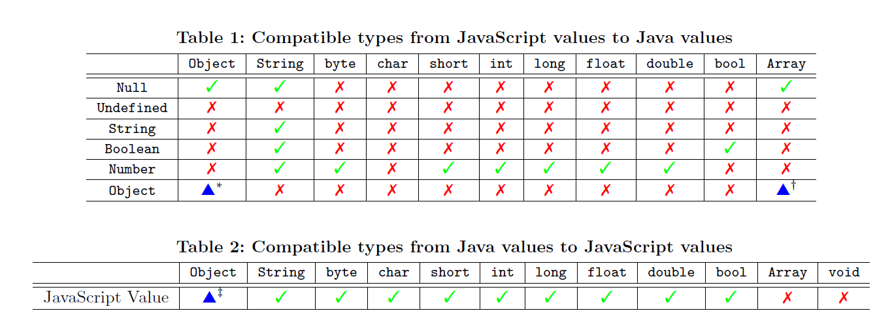；对于对象，只允许传递类型兼容的桥对象或数组。
     
      - 使得JavaScript可以改变Java环境，存在安全隐患
- **挑战**
  - 多JavaScript环境：WebView可能分开加载多个独立的JavaScript代码
  - 动态载入代码
  - 分析敏感度
  - 不同安卓版本：安卓17之后需要加上`JavascriptInterface`标注才能被调用。
- **方法**：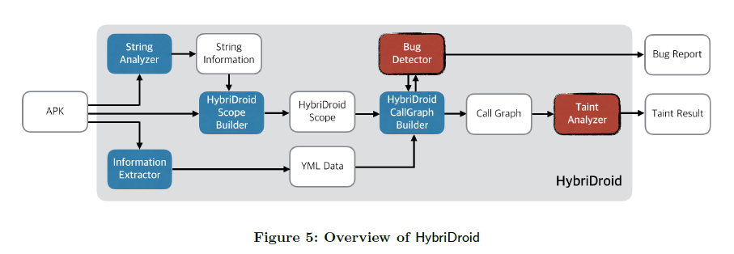
  - 基于WALA的JavaScript和Java分析模块
- bug：
  - 找不到Java方法
  - Java方法未调用
  - 方法类型重载：不允许以参数类型重载方法
  - 不兼容类型
- 污点分析：
- **实现**
  - WALA
- **实验**：
  - bug检测：88 混合app。其中14个app有31 bugs，其中24 TP，TP全都是“未找到方法”。其中20个由于缺少标注，1个未定义，3个由于代码混淆。
  - 隐私泄露：上述48 app，发现19个广告平台。展示了1个case。
- **点评**：看来缺少标注是这篇文章的motivation了。

#### [Static Analysis of JNI Programs via Binary Decompilation]()
- TSE 23, Jihee Park, Sungho Lee, Jaemin Hong, Sukyoung Ryu
- **问题**：
  - 现有方法不适用于编译后的JNI程序，或者第三方库只有二进制。
  - 之前的二进制分析方法只停留在语法层面，因此调用图和数据流不精确，无法发现一些类型的安全漏洞。
  - [JN-SAF](#jn-saf-precise-and-efficient-ndkjni-aware-inter-language-static-analysis-framework-for-security-vetting-of-android-applications-with-native-code)：无法处理多执行路径（？）、全局变量、动态dispatch
- **挑战**：
  - 反编译产生的C代码不可编译，类型不精确。
  - **解决方法**：启发式生成可编译C代码，提供准确类型信息
- **方法**：
  1. 提取签名：输入Java字节码，提取native meethod的签名
  2. 交互式反编译：根据方法签名和库，生成C代码
     1. 反汇编：利用Java端的native方法签名，启发式获得函数签名和数据类型
     2. 生成IR（类C）
        - 传播`JNIEnv*`类型：即便提供了`JNIEnv*`，反编译器并不会把类型传播下去。比如传递给参数为`int`的函数，反编译器会添加类型转换，而不是改变参数的类型为`JNIEnv*`。因此跟踪`JNIEnv*`的传播，修改类型。
        - 修改JNI接口调用参数（定长）：反编译器错误推测JNI接口函数的参数数量。通过跟踪`JNIEnv*`识别调用。
        - 修改JNI接口调用参数（变长：这类接口都是用来调用Java方法的。根据指定目标方法的参数，反向追踪其创建点，可以获得目标方法的签名。
        - 利用额外类型信息辅助反编译，再把额外类型删掉（换成`void*`）：添加类型如`AndroidBitmapInfo`，但是这些类型并不在源文件中定义
     3. 生成伪代码
  3. 生成C代码
  4. 分析源码
- **实现**：
  - 提取签名：FlowDroid
  - 反编译：IDA、Ghidra with HEx-Rays反编译器
  - 源码分析：[$JSA_{SC}$](#broadening-horizons-of-multilingual-static-analysis-semantic-summary-extraction-from-c-code-for-jni-program-analysis)
- **实验**：
  - **数据集**：NativeFlowBench（23个app），只能处理16个
  - **指标**：
    - 提取互操作？：跨语言调用数量 
    - 启发式的作用？：开关每一个变换新增的$C \rightarrow J$调用
    - 数据泄露检测?：以JN-SAF为baseline，指定source (`TelephonyManager.getDeviceId()`)、 sink
    （`android_log_print`）

#### [Identifying Java calls in native code via binary scanning](https://dl.acm.org/doi/10.1145/3395363.3397368)
- ISSTA 2020, George Fourtounis, Leonidas Triantafyllou, Yannis Smaragdakis (U~ of Athens)
- **问题**：
  - 缺少native code到java的调用将严重影响静态分析可靠性，主要体现在**入口点**少了
  - [lee](#broadening-horizons-of-multilingual-static-analysis-semantic-summary-extraction-from-c-code-for-jni-program-analysis)的方法太过笨重，而且针对源码。
- **方法**：
  - 从Java代码中提取方法签名
  - 查找native code，搜索方法签名的字符串
  - 定位字符串的使用位置
    - string x-refs：字符串引用并不一定是常数，可能是运行时确定的（位置无关代码）
    - 这个分析最终是用来辅助DataLog指针分析的，因此还要模拟回调的实参。
    - *本文的写法是分析可以增加Java端的入口点，因此回调参数不精确。*
- **实现**：  
  - Doop：基于DataLog，Java字节码指针分析
  - Radare2：分析二进制，生成IR，定位字符串
- **实验**：
  - 数据集：XCorpus中有native代码的（4）、HeapDL的benchmark中表现出native代码回调的安卓app（2）
  - 指标：
    - XCorpus：回调函数数量（增加的入口点）、增加的可达方法、总数量。人工审查回调目标。
    - 安卓app：以动态分析为ground truth，recall 100%。同上。

#### [Combinations of Reusable Abstract Domains for a Multilingual Static Analyzer?]()
:::warning
补全 
:::
- Matthieu Journault, Antoine Mine, Raphael Monat, and Abdelraouf Ouadjaout (Sorbonne U~)
- **背景**：
  - 抽象解释：程序语义的近似，可以理解为解释器，但是这种解释器运行在所有的输入和路径，并且忽略语义细节。
- **贡献**：
  - MOPSA：模块化静态分析框架，可以结合、自定义多种抽象域
  - 基于统一可扩展语言：AST。
    - 语法可扩展：语法用OCaml定义

#### [JET: Exception Checking in the Java Native Interface](https://dl.acm.org/doi/10.1145/2048066.2048095)
- OOPSLA 11, Siliang Li, Gang Tan (Lehigh U~)
- **问题**：native方法关于异常的声明与实现之间的不一致，Java端native方法的抛出异常声明不符合native代码。
- **方法**：
  - 库代码与接口代码分离
  - 查找异常：
    - 路径敏感： 
    - 上下文敏感
- **评价**：[这篇论文](#exception-analysis-in-the-java-native-interface)的前置工作。

#### [μDep: Mutation-Based Dependency Generation for Precise Taint Analysis on Android Native Code]()
:::warning
补全实验 
:::
- TDSC 22, Cong Sun, Yuwan Ma, Dongrui Zeng, Gang Tan, Siqi Ma, and Yafei Wu
- **问题**：
  - 安卓app中的native code是不安全的，因为它对传统静态分析而言是一个黑盒。现存静态信息流分析只能分析bytecode层面，不能分析native code。
  - 两种缺陷：native和bytecode互为source、sink，相互调用；source、sink都在bytecode，经由native code传播（bytecode调用native，并且native调用bytecode）。
  - [JN-SAF](#jn-saf-precise-and-efficient-ndkjni-aware-inter-language-static-analysis-framework-for-security-vetting-of-android-applications-with-native-code)不够精确
- **贡献**：
  - uDep：结合DroidSafe，识别敏感信息流。动静态结合的方法，静态的二进制控制流分析+基于变异识别native code的污染效果
  - 给native code建模方法：基于变异测试得到的输入返回关系；
- **方法**：
  1. 用IDA做二进制静态分析
    - 查找对Java方法的调用，是否是source/sink，鉴定为type 1缺陷。
    1. 从二进制中提取代码，发现JNI函数的调用`CallXXXMethod`，判断是否是source/sink
    2. 反向查找使用这些source/sink的native函数
    3. 判断这些native函数是否在Java端声明，加入到DroidSafe的source/sink列表
    4. 对于添加进source列表代理方法，假如其native函数返回类型`T`，则污染代理方法的返回值或输出参数为兼容类型`T'`
  2. 基于变异算法分析native方法的输入输出依赖
     - 视native代码为黑盒，输入是参数，输出是返回值和对象类型参数
     - 改变输入，观察输出是否变化。使路径尽量覆盖。
  3. 利用语义和输入输出依赖，生成stub： 
     - 基本 -> 基本：直接把输入类型转换成输出（描述两者的污染传播关系） 
     - 基本 -> 非基本：用`addTaint`把输入添加到输出的域`taint`（*详情要看DroidSafe*）
     - 非基本 -> 基本：把`getTaint(<input>)`赋值给输出。
     - 非基本 -> 非基本：若类型兼容，直接赋值；否则使用`getTaint`、`addTaint`。
- **实验**：
  - 数据集：
    - S1（143）：NativeFlowBench、DroidBench
    - S2（5096）：AndroZoo
    - S3（2052）：Drebin、DroidAnalytics、CIINvesAndMal1029中的恶意软件
  - baseline：DroidSafe、JN-SAF
  - 指标：
    - 准确率：S1

#### [Multi-language static code analysis on the LARA framework](https://dl.acm.org/doi/10.1145/3460946.3464317)
- SOAP 21, Gil Teixeira, João Bispo, Filipe F. Correia (Faculty of Engineering, U~ of Porto)
- **问题**：
  - 许多语言的很多概念是共通的，这让多语言分析成为可能。但是不同语言仍有不同，如语法特性。
  - 关于Lara：若结合不同语言的规约合并成一个，会污染原来的规约，并且破坏兼容性。
- **贡献**：
  - 多语言分析：基于LARA。Lara通过一个语言规约来定义对目标语言的编译器。他们改进成支持多个，并且支持共通的语言规约。 
- Lara：
  - *同一个组之前的成果*。
  - Java编写的源对源编译器。
  - 允许用JavaScript脚本来自定义语言无关的分析。
  - 对一个语言规约，生成编译器的Java代码
- **方法**：
  - 共通的语言规范没有定义组合关系，对一个节点的询问都是基于它的后代。相当于它提供了虚拟的AST，每次询问都会在具体语言的AST下遍历。（*我也没搞懂在说什么，需要看他们关于Lara的工作*）
  - 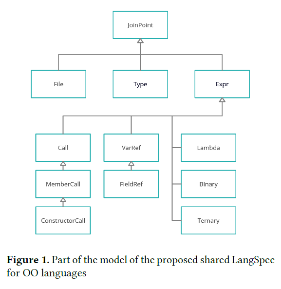

#### [Gillian, part i: a multi-language platform for symbolic execution](https://dl.acm.org/doi/10.1145/3385412.3386014)
:::warning
补充完整
:::
- PLDI 20, José Fragoso Santos, Petar Maksimović, Sacha-Élie Ayoun, Philippa Gardner (Imperial College London)
- **问题**：
  - 开发一个语言的符号执行 需要很多努力，因此迁移至另一个语言就更加困难了。
- **背景**：
  - symbolic-lifting：把具体语言的解释器提升至符号解释。
  - semantic framework：用统一的规约语言来描述不同编程语言，然后生成不同的分析工具。
  - IR based：先编译成统一的的IR，再基于IR做符号分析。
  - 前两个方法允许开发者使用预置的数据结构（list、map）来实现内存模型，符号推理是基于这些数据结构的（语言无关 ）；第三个方法提供了一系列内存模型，但是不能添加新的。
- **贡献**：
  - Gillian：基于IR的多语言符号执行工具
    - 允许自定义内存模型
    - 符号推理是语言相关的
    - 符号推理的正确性需要特定的内存模型符合几条引理。
    - 基于参数化IR：GIL
  - 证明了Gillian的可靠性（parametric soundness results）（*啥玩意儿？*）
- **方法**：
  - GIL：
    - 语法：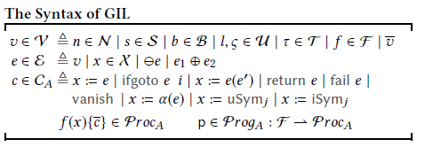
      - 值：number、字符串、boolean、非解释符号、types、procedure、list
      - 表达式：变量、运算
      - 指令：赋值、条件跳转、动态调用、返回、退出
      - 特殊指令：动作$x = \alpha(e)$、$x = uSym_j$生成非解释符号、$x = uSym_i$生成解释符号
      - 非解释符号：语言有关的常量（`undefined`、`null`）、内存地址、对象；解释符号：逻辑变量
    - 语义：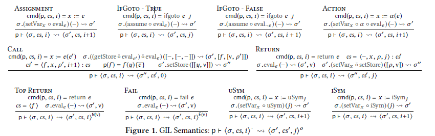
      - 参数化的，以状态模型为参数
      - 状态模型：状态 + 状态的取值 + 动作 + 迁移函数
      - ==未完待续==
- **实现**：
  - JavaScript/C符号执行

#### [CLCDSA: Cross Language Code Clone Detection using Syntactical Features and API Documentation]()
- ASE 19, Kawser Wazed Nafi, Tonny Shekha Kar, Banani Roy, Chanchal K. Roy and Kevin A. Schneider (U~ of Saskatchewan)
- **问题**：
  - 代码克隆会导致维护难度：一边的代码改了，另一边也要改；从而带来隐患，降低代码质量。
  - *可能缺少实际意义：跨语言代码克隆相当于重新开发了，开发者是理解了之后再写的，而且测试也是另外写的，与无脑的复制粘贴不同。本文的intro举的简单的例子。*
  - 已有跨语言代码克隆检测：CLCMiner利用代码历史和相似度、LLCCA基于具体语法树表示
- **贡献**：
  - CLCDSA：不需要中间表示或限制 
  - 提取9个语法特征，比较cosine 相似度
- **方法**：
  1. 特征：
    - 在之前的研究中，他们筛选了SQO-OSS中评价代码质量的24个特征，发现其中9个在Java、C#、Python表现得一样。
  2. 预处理：
    - 去除注释、字符串常量
    - 生成AST，用正则表达式提取特征
    - 提取API调用
  3. 行为过滤：
     - 前人的做法：分析源代码的token比较语义相似度、比较API调用的语义相似度。
     - 前人的发现：不同语言的API调用相似度可以从文档相似度中学习、检测出来（*什么叫学习检测出来？*）
     - **假设**：假如两个语言的API任务相同，那么文档的语义相同。如Java的`println`和C#的`write`。
     - 用word2vec，计算文档相似度来计算API的相似度
     - 对于可能克隆代码对，取一边的一个API调用，获取它和另一边的所有API调用的相似度，取最高的为一对。（*单射？*）最后取每一对相似度的平均值。
     - 低于阈值的代码对被去除
  4. 计算9个特征的cosine相似度，与阈值比较；或者用DNN模型直接判断是否克隆。
- **实现**：
  - 生成AST：AntkrV4
  - 行为过滤：
    - DNN模型：word2vec-GoogleNews-vectors
    - 数据：API文档的第一句话
  - 判断克隆：
    - 模型：Siamese Architecture Neural Network
    - 数据集：
      - 开源编程比赛的Java、C#、Python答案（78k）：AtCoder、Google CodeJam、CoderByte。*这个数据选择得很聪明。*
      - *其实也没那么好，虽然都是回答同一个问题，但是他们的算法不一定一样，回答之间的相似度没那么高。而且同一个算法，不同的人实现得也是千差万别。假如能发现这种相似度，那就是很高层面的相似度了。*
- **实验**：
  - 数据集：上述竞赛回答
  - 指标：precision、recall、f1
  - 比较：LICCA、CLCMiner、AST Learner
  - 结果：DNN的方法比cosine相似度好；本文方法f1远远大于其他工具。
- **评价**：看岔了，这不算做静态程序分析，算了，看都看了。

 #### [DroidNative: Automating and optimizing detection of Android native code malware variants](https://www.sciencedirect.com/science/article/pii/S016740481630164X)
 ::: warning
 补充
 :::
 - Computers & Security 17, Shahid Alam (Gebze Technical U~), Zhengyang Qu, Yan Chen(Northwestern U~), Ryan Riley (Qatar U~), Vaibhav Rastogi (U~ of Wisconsin-Madison)
 - **问题**：
   - 恶意软件几乎集中在安卓
   - 恶意软件会用代码混淆来应对基于签名的检测（*可能是基于模式吧*）
   - 对native code的恶意检测很少
- **贡献**：
  - DroidNative：跨平台（x86、ARM）工作于native code层面，可以检测bytecode和native的恶意软件。native code这里指的是二进制。
    - 用静态分析，着眼于控制流的模式，控制流不会被代码混淆影响。
    - 用ART把bytecode编译成native code
  - 改进恶意分析中间语言（MAIL）
    - 添加ARM
    - 提升准确率和速度
- **背景**;
  - 安卓会动态加载代码
  - 恶意分析中间代码：保留二进制代码中高阶的表示，如控制流信息、函数、API调用和模式
- **方法**：
  - MAIL：
    - 8种语句、21个模式。每条语句都标记了模式，用作比较、匹配、标记CFG
    - 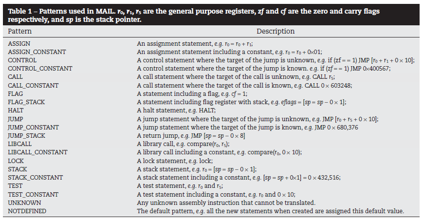

#### [Towards Cross-Platform Cross-Language Analysis with Soot](https://dl.acm.org/doi/10.1145/2931021.2931022)
- SOAP 16，  Steven Arzt, Tobias Kussmaul (TU Darmstadt),Eric Bodden (Paderborn U~)
- **问题**：
  - 不同语言的跨语言分析差别很大
  - 用同一个IR支持不同的语言是困难的
- **贡献**：
  - 用Soot来作跨语言静态分析Java/C#
  - 提出Common Intermdeiate Language（CIL），实现CIL不需要修改Jimple。扩展Soot使CIL也成为.net和Mono的bytecode。
- CIL：
  - 代码组织：class - namespace（package） - assembly
  - 类型：
    - 支持对象和结构体，int和float也是结构体。
    - Jimple中结构体也是类，但是它的传递用clone。
    - C#中允许引用传参，为表达这种情况，此时就不clone。

#### [Understanding and fixing multiple language interoperability issues: the C/Fortran case](https://dl.acm.org/doi/10.1145/2884781.2884858)
- ICSE 16, Nawrin Sultana, Justin Middleton, Jeffrey Overbey, Munawar Hafiz (Auburn U~)
- **问题**：多语言的互操作没有仔细研究过
- **贡献**：
  - 对C/Fortran做互操作的case study，揭示接口暴露、数据类型共享、内存管理、数据共享机制。

#### [On the Static Analysis of Hybrid Mobile Apps](https://onlinelibrary.wiley.com/doi/10.1002/spe.2276)
- Achim D. Brucker(The U~ of Sheffield) and Michael Herzberg (Vincenz-Priessnitz-Strasse)
- **问题**：
  - 混合app有安全问题，继承了网页pp和原生app的安全问题
  - 插件是打通WebView沙盒和原生环境的一个洞，XSS攻击可能利用插件
- **背景**：
  - Apache Cordova是一个多平台的混合pp框架
  - JavaScript通过`exec`调用Java端，Java通过回调返回到JavaScript
  - `exec`会调用Java端的`execute`方法，方法中会根据传入的`action`字符串选择相应的动作
  - Java回调JavaScript通过调用`CallbackContext`的3个方法：`success`、`error`、`sendPluginResult`
- **贡献**：
  - 针对Apache Cordova（JavaScript/Java）的静态分析：构建调用图
  - 
- **方法**：通过4种启发式的处理应对这个框架的特性
  1. 模拟`exec`：把`exec`替换成stub函数，stub函数中直接调用回调函数
  2. 模拟模块载入：把模块导出的对象变成全局的，也就是把`module.exports`换成一个全局变量。
  3. 确定Java端的callsite和JavaScript的callee（success、fail）：
    - 找到所有从`execute`到`CallbackContext`方法的调用链
    - 得到`execute`的控制流图，已知JavaScript传入的`action`字符串常量，可以得知在哪里调用的`CallbackContext`的哪个方法
  4. 过滤：
    - 挑战：目前适用于大型JavaScript项目的分析是field-based的，一些plugin提供的接口名字会混淆
    - 利用文件名等（*？？？*）信息过滤掉
- **实现**：
  - WALA

#### [Cross-language program slicing for dynamic web applications](https://dl.acm.org/doi/10.1145/2786805.2786872)
- FSE 15, Hung Viet Nguyen, Tien N. Nguyen (Iowa State U~), Christian Kästner (Carnegie Mellon U~)
- **问题**：
  - web应用难以做切片：多语言、客户端代码动态生成
  - 多语言：PHP/SQL - HTML/JS
  - 客户端代码动态生成：客户端程序实体嵌入在PHP字符串常量中，程序切片需要识别这些程序；客户端代码取决于服务器代码的条件分支。
- **背景**
  - 正向程序切片：对某一个程序点的某个变量（slicing citerion），切片表示程序中所有会被变量影响的部分
  - 瘦切片：基于数据流的；传统切片：基于数据和控制流。 
- **贡献**：
  - WebSlice：
    - 基于实体间的数据流（def-use）
    - 利用符号执行、可变性有关的parser
    - 面向PHP、SQL、HTML、JS。
- **方法**：
  1. 符号执行PHP代码，得到输出
    - 输出：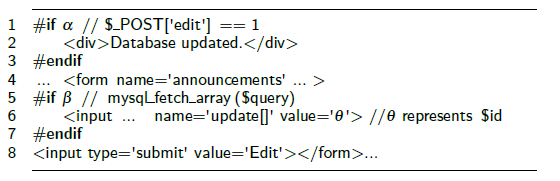
    - $\alpha$、$\beta$表示条件
  2. 用符号分析（顺便）构建PHP、SQL的数据流
    - 数据流包含def-use和信息流
    - 信息流：同一语句内，使用的变量会影响定义的变量，比如$x = y$，存在$y \rightarrow x$的信息流。 
  3. 分析输出以构建客户端代码（HTML、JS）的数据流
    - 变化有关的解析：因为上面的输出是带条件的代码
    - 解析结果：可变的DOM，node带条件。DOM里面也包含带条件的JS代码的AST
    - JS的数据流分析也是用符号执行
    - 
  4. 连接数据流
  5. 切片
- **实现**：
  - 符号执行：前面的工作
  - 数据流分析：TypeChef
- **评价**：这里的跨语言不太一样。其他跨语言的场景都是，一个语言调用了用另外一个语言写的库。语言交互的方式是传参和返回值。而这里的跨语言是JS代码是由PHP生成的。
  - JS代码不是固定的，这里研究的是变化的JS代码，但是这种变化是由PHP运行时带来的。
  - 跨语言交互的方式是代码生成，JS代码从PHP得到的一个值不是运行时得到，而是静态hardcore进代码中的。而PHP从HTML获得一个值的方式是http的输入。

#### [Automatic generation of library bindings using static analysis](https://dl.acm.org/doi/10.1145/1542476.1542516)
- PLDI 09, Tristan Ravitch, Steve Jackson, Eric Aderhold, Ben Liblit (U~ of Wisconsin–Madison)
- **问题**：
  - 目前binding code是用手写的
  - 现有的binding生成工具：SWIG、ctypeslib、各项目自己的工具，基于C头文件
  - 基于头文件的方法一般需要标记，是为了利用高层代码的特性（*？*）
- **贡献**：
  - 论证了自动化生成binding code是必要的
  - 提出了根据无标记库代码生成binding code的策略，基于对库代码实现部分的静态分析。
  - 面向Python/C
- **方法**
  1. 预处理：
     - 数组读取改成指针操作
     - 所有函数只有唯一出口
     - SSA形式
     - 做了全局别名分析
  2. 静态分析
    - 模块（库）分析、过程间、上下文不敏感、路径不敏感
    - 信息由callee传向caller
    - 输入、输出：接口描述，分析的fact
    - 发现输出参数
      - 是指针、写入早于读取
      - 输入参数：只有读；输入兼输出参数：读后写
      - 对于写：考虑must别名；对于读：考虑may别名。
    - 发现数组：
      - 是指针、参与运算且结果被解引用
      - 通过进程间信息流倒推caller的传入的实参是数组
      - 可以通过发现元素也是数组来推出数组的结构，但是没有长度。
      - 例外：可能通过全局的结构体中的数组来传递。
    - 内存管理：
      - 发现构造器：
        - 返回值是已知构造器的返回值
        - 返回值是$\phi$，但是所有输入都能被现有的析构器释放（*？*） 
      - 发现析构器：
  3. 生成binding：
     - 用ctypes
     - 对C函数生成Python wrapper函数：
       - 利用上述发现的输出参数，确定输入输出参数数量
       - 对于数组类型，wrapper运行时检查参数类型为list，并使用ctypes创造一个数组，进行浅拷贝。根据数组结构来嵌套构造数组。
       - 对于构造器，将返回的指针包装为Python对象，将Python对象的`__del__`和析构器绑定
       - 对于析构器（意味着显式调用析构器），wrapper参数为Python对象，则解除被析构参数的`__del__`，防止重复析构。
       - 对于有逃逸参数的函数，解除它们的`__del__`。
- **实现**：
  - 生成SSA：LLVM、CLang
  - 别名分析：Anderson
- **实验**：
  - 数据集：4个开源C库，GLPK，libarchive，libical，GSL
  
#### [Finding bugs in java native interface programs](https://dl.acm.org/doi/10.1145/1390630.1390645)
- ISSTA 08, Goh Kondoh Tamiya Onodera (Tokyo Research Laboratory)
- **问题**：
  - 开发JNI是易错的：
- **贡献**：
  - 静态分析检测：错误检查的bug、内存泄漏、无效使用局部引用、关键区的JNI调用
- **背景**：
  - 缺少错误检查：忘记在调用Java方法后检查有没有异常，而在此后调用第二个Java方法，VM会忽略前面的exception。在某些VM会动态报出warning。
  - 内存泄漏：native代码可以调用JNI函数，申请一些资源，如`GetStringChars`
  - 非法使用局部引用：当native代码引用Java对象时，分为局部和全局，全局变量应该用全局引用。
  - 关键区调用JNI：可能导致关键区被阻塞
- **方法**：
  - 缺少错误检查：
    - 类型状态（typestate）分析，也是数据流分析
    - 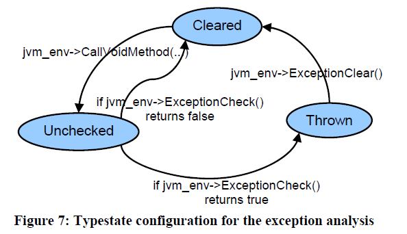
  - 内存泄漏：同上类似
  - 关键区调用：同上
  - 非法使用局部引用：语法检查
- **实现**:
  - BEAM：过程间分析（*自己写的数据流分析？有点牛b吧*）
- **实验**：

#### [Checking Type Safety of Foreign Function Calls](https://dl.acm.org/doi/10.1145/1065010.1065019)
- PLDI 05, Michael Furr, Jeffrey S. Foster (U~ of Maryland)
- **问题**：跨语言的类型系统、数据表示、运行时环境不死他，正确性难以保证。
- **贡献**：
  - 多语言类型推理，可以检查类型和垃圾回收问题。
  - 这个类型系统关注物理表示
  - 面向OCaml/C，其中OCaml是主语言。
- **背景**：
  - 所有OCaml类型在C中都是`value`类型，被typedef为`long`（在C中，这是意味着相同的类型）。但它的物理表示并等于其含义，需要用宏`Val_int`、`Int_val`来和整型相互转换，而开发者可能把宏用在错误的类型上。
  - `value`类型可能包装了一个值，或者指向存储着值的一个块。C中用`Is_long`判断是否是指针。
  - nullary constructor出现在OCaml的sum类型中，相当于枚举的成员。也可理解为一种类型，但这种类型只有一个取值，就是它在sum type的序号。
  - C有宏`Val_int`、`Int_val`转换`value`
  - C用`CAMLparam`、`CAMLlocal`向OCaml的堆注册参数和局部变量，用来表示C指针指向这些值。用`CAMLreturn`释放。
  - OCaml有垃圾回收
- 类型系统
  - 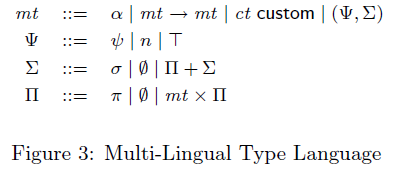
  - 就是把对方的类型加入到自己的类型系统中。

#### CGORewritter: A better way to use C library in Go
- SANER 23
- **问题**：利用CGO开发胶水代码是易错的。
- **贡献**：
  - CGORewriter：接收一个描述，基于程序分析和规则
- **背景**：
  - CGO是Go和C之间的FFI机制，以C为guest language。
  - Go/C胶水代码生成的半自动化工具：SWIG、GoCxx
    - 需要手动管理内存
    - 依赖一个模板
- **实验**：
  - 重写`go/crypto`的包（4个）
  - 指标：运行速度提升（？）

#### Cross-Language Code Search using Static and Dynamic Analyses
- **问题**：
  - code2code search：用一段代码去搜索仓库中相似的代码
    - 代码迁移、代码克隆识别、程序修复

#### Dynamic Generation of Python Bindings for HPC Kernels
- ASE 21, Steven Zhu, Nader Al Awar, Mattan Erez, and Milos Gligoric 
- **问题**： 
- **背景**：
  - HPC：高性能计算
  - HPK：高性能核，计算程序，如线性求解器
  - HPK提供计算，框架将运算迁移到不同硬件平台
  - 迁移到动态语言的两种方式：重写或者写binding。 
  - Python/C binding 生成：cppyy、pyximport
- **贡献**：
  - WAYOUT：自动生成binding code
  - 给定头文件，WAYOUT生成：
    - Python端的wrapper类和wrapper函数
    - **运行时实例化**的C模板，在Python wrapper函数调用时，动态生成binding代码，翻译数据类型
  - 特点：将binding生成推迟到运行时，当给定需要的数据类型时。
  - **因为C++有函数重载而Python没有**，为了保持API一致，就需要用一个Python函数去调用不同的C++函数，就需要根据运行时的参数数量来动态选择binding的目标。
  - 尤其是遇到**C++模板**，不可能把所有可能性都枚举一遍，因此需要动态生成binding。
- 方法：
  - 用Clang分析头文件，提取API，生成镜像的Python wrapper代码 。
  - 动态生成：
    - wrapper函数里面包含一句`generate_function_binding`，然后尝试导入so，假如没有就利用C++ template实例化源代码再编译一个。
- **实验**：
  - 给Kokkos Kernels（39个kernels ）、Thrusts生成binding
  - 重写了7个applications（因为生成的API和原来不一样。）
  - RQ: effectiveless、run-time overhead、 performance between handwritten binding、time to generate。

#### Static Type Inference for Foreign Functions of Python
- ISSRE 21，Mingzhe Hu, Yu Zhang, Wenchao Huang, Yan Xiong 
- **贡献**：
  - **基于规则**的对Python外部函数的静态类型推导
  - 规则分为：外部函数声明（由C函数得到一个Python函数）、参数转换、返回值转换 
- **方法**：
  - 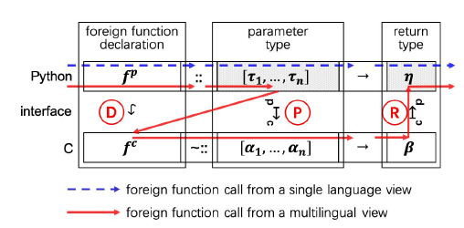 
  - 找到C的interface层中的转换函数 
  - 类型：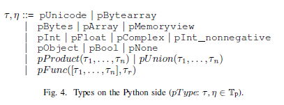
    - 都是基础数据类型，pObject没有属性
    - list、dict、tuple统一为pProduct
    - Python/C API支持细粒度的转换（限定取值），因此在int基础上引入nonint
- **实验**
  - 指标：
    - completeness：能够推测的foreign function占比（*这不扯淡吗*）
    - effectiveness：含义是sound，人工检查Pillow项目（132个FF）
    - mismatch bug：

#### Practical Static Analysis of JavaScript Applications in the Presence of Frameworks and Libraries
- FSE 13， Magnus Madsen，Benjamin Livshits，Michael Fanning
- **背景**：
  - JavaScript运行在复杂环境中，如HTML DOM、jQuery、node.js、Windows 8，这些部分难以分析。
  - 标准做法是重新实现：stub
  - 在给HTML DOM`querySelector`有两种建模：返回`HTMLElement.prototype`和返回网页上的任何元素。
- **贡献**：
  - 根据API返回结果的**使用分析**来对API建模，比如返回对象必须有`getContext`、`width`、`height`三个属性。
  - 本文要解决的其实不是建模问题，而是在缺少libary code或者stub不完善的情况下，对JavaScript进行分析。
- **方法**：  
  - 部分推导：在有stub的情况下推导，用来连接JavaScript和library code
    - 对library code的堆也用allocation site抽象
  - 全推导：不需要有stub，基于使用来推导
    - 缺少library code的堆，用symbolic location来对这一部分建模。
  - 迭代：用部分推导，发现没有返回值的库、没有被回调的参数、缺少的域，建立symbolic location，然后再推导。
  - unification：把symbolic location和allocation site匹配起来
    - 共享一种属性
    - 共享全部属性
    - 和prototype匹配

#### Building Call Graphs for Embedded Client-Side Code in Dynamic Web Applications
- FSE 14, Hung Viet Nguyen, Christian Kästner, Tien N. Nguyen
- **背景**：
  - 动态网页应用：有服务器端生成客户端应用，前者用PHP、后者是HTML/JS。
- **贡献**：
  - 对sever code分析，构造出client code的调用图。
  - 使用到符号分析、可变parsing、调用图分析

#### Adlib: Analyzer for Mobile Ad Platform Libraries
- ISSTA 19, Sungho Lee, Sukyoung Ryu
- **背景**：
  - AdSDK：提供广告的一类SDK。JavaScript做UI，native code访问设备资源。其中AdSDK是native code编写的，AdLibrary是JavaScript包装。
  - 上层代码是广告商，是未知来源，因此
- **贡献**：
  -  静态分析AdSDK：分析其从入口开始的数据流，假如数据流满足一定模式，就认为是漏洞。
  -  只针对AdSDK API分析。
  -  报告安全漏洞
-  **方法**：
   - 不是基于src/sink，而是定义7种漏洞行为，也就是API调用序列。总结出7种API调用序列的模式来检测。
- 上一篇论文：[HybriDroid](#hybridroid-static-analysis-framework-for-android-hybrid-applications)
- **实验**：
  - 分析24个AdSDK，
  - 指标：FP、FN

### 动态
#### [Mimic: computing models for opaque code](https://dl.acm.org/doi/10.1145/2786805.2786875)
:::warning TODO
把问题、贡献、方法补全
:::
- FSE 15
- 动态分析给C建模。运行C函数，捕获traces，通过traces来建模。

####  [Automatic Modeling of Opaque Codefor JavaScript Static Analysis](https://dl.acm.org/doi/10.1145/2025113.2025125)
- FASE 19, Joonyoung Park、Sukyoung Ryu
- **贡献**：  
  - 动静态结合技术：当静态分析遇到不可用代码，先具体化抽象值（采样），运行程序，得到返回值并抽象它。其中采样用组合测试的方法。
- 动态分析C函数。通过组合测试的方法。对于js端的数据流分析，对于调用C端函数的程序点，对参数的抽象值采样具体取值。然后调用C端函数跑一遍，对返回值再抽象回去。
- 上一篇：Analysis of JavaScript web applications using SAFE 2.0

#### [PolyCruise: A Cross-Language Dynamic Information Flow Analysis](https://www.semanticscholar.org/paper/PolyCruise%3A-A-Cross-Language-Dynamic-Information-Li-Ming/4511acdf1e7cf798fad081b691b7c9b7b3bc4186)
- USS 2022, Wen Li, Haipeng Cai(Washington State U~), Jiang Ming(U~ of Texas at Arlington), Xiapu Luo(The Hong Kong Polytechnic U~)
- **问题**：多语言软件的漏洞可能跨语言或者在语言边界上。目前大部分跨语言的安全分析集中在JNI上。另外一些工具不够实用：语言扩展性不足、规模扩展性不足。
- **挑战**：语义异构、效率
- **贡献**：
- **方法**：静态与动态分析相结合，动态分析弥补因语言的不同而导致静态没法分析的部分；静态分析指导动态分析插桩，以达到较好的延展性和效率。
  - 特定语言分析：生成语言无关的符号表示（LISR）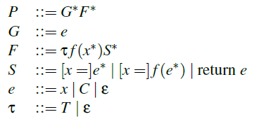
    - 3种指令：赋值、调用、返回。**field-insensitive**
    - 2种符号：全局和函数 
  - 符号有关的分析（SDA）：计算与sources/sink有关的近似依赖
    - 依赖：$S_i$、$S_j$都是指令，如果$S_j$使用了$S_i$定义的符号，则说$S_i$依赖$S_j$。可以看出这里的依赖是等价关系。
    - 把依赖设计成对称的，是因为没有别名分析，会丢失一些真依赖（？）
    - 输入sources，然后计算哪些语句是可达的。可达指的是def-use、跨过程、正向和反向。
    
  - 插桩：
    - 静态插桩： 只对编译后的代码根据SDA中sources可达的语句插桩。
    - 动态插桩：针对动态类型语言，同样只对sources可达的指令。 
    - 运行时事件：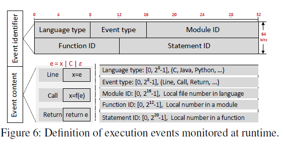 。和LISR一样记录三种指令。但是表达式不再是符号，而是数据类型、地址。
  - 动态分析：以运行时事件为节点构建动态信息流图，分为不同线程。
    - 线程间控制流：跨线程的call事件。
    - 线程内控制流：有时序的两个事件。
    - 线程间数据流：跨线程，有def-use关系且满足时序，而且涉及的是共享或全局变量。
    - 线程内数据流：类似 
  - 漏洞分析
  - **完全没有涉及跨语言**，其中最重要的是没有说如何处理语言边界，SDA的时候也没有说如何将两种语言的数据流对齐。只能猜测在生成LISR时透过了语言边界用统一的符号来表示。
- **实现**：面向Python-C
  - 输入：程序、配置（sources/sinks、安全分析）、程序执行输入。
  - C：静态分析、静态插桩用LLVM，
  - Python：静态分析用PyPredictor； 动态插桩用`sys.settrace`；监视实现为C库，然后从Python链接。
  - 7种漏洞分析插件：sensitive data leak, control flow integrity, partial comparison, buffer overflow, integer overflow, and divide  by zero
- **评估**：
  -  手工数据集PyCBench：人工制作46 benchmarks，每个一个输入。
  -  real-world软件： 12个，3k-6m代码 
  - 效果（precision/recall）：
    - positive是指有vulnerable，也就是source/sink连通
    - 人工审查。对于real world projects，选取**5个最不复杂** *（？）*的project来分析，对给定的sources/sinks运行完整的动态分析的traces作为groundtruth，选取其中**15条**traces人工审查。
    - PyCBench只有在field-senstive/object-sensitive中出现1-2 FP；real world projects中recall**全部100%**，precision几乎全部100%，平均88.2% ；若把exploitable视作TP，平均58.8%。  
  - 效率（代价）：
    - SDA：对<=200k代码，2s/100M；对Pytorch，175s/7GB。
    - 动态slowdown、内存峰值。 
  - 能否找漏洞
  - 工具比较。

:::info Python/C的两种FFI
- `ctypes`允许Python载入C的动态链接库。整个库会包装成`CDLL`对象，导出的C函数是这个对象的属性。调用C函数可以用built-in对象来作为参数。
- Python/C API：C开发者使用API把C包装成Python的模块。与上面不同，此时C代码对Python是已知的，而且要遵守Python/C的规范来编写代码。
:::

:::info Field-X Analysis
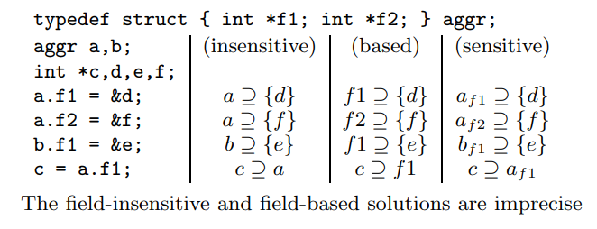
- field-insensitive: 属性直接抹掉，变成base之间的赋值。
- field-based：不同实例的同一属性被统一起来。
- field-sensitive：不同实例的属性分开对待。
:::

#### [Toward efficient interactions between Python and native libraries](https://dl.acm.org/doi/10.1145/3468264.3468541)
- FSE 21, Jialiang Tan, Yu Chen, Zhenming Liu, Bin Ren (William & Mary), Shuaiwen Leon Song (U~ of Sydney), Xipeng Shen, Xu Liu (North Carolina State U~)
- **问题**：
  - 跨语言程序中，上层开发者不了解下层的实现，写出了效率较低的代码。如：没有发现可以向量化的矩阵操作、循环效率低。
  - Python的profiling工具解决不了这个问题，因为没法进入native代码；native profiling工具不知道Python的语义，找不到根本来源（*感觉这理由有点抽象*）
- **贡献**：
  - PieProf：轻量定位Python程序中低效率交互的profiler；基于硬件的性能监控单元（PMU），用硬件排错寄存器（hardware debug register）识别冗余内存操作（CL算法）
  - 研究并分类Python和native之间的低效率互操作
  - 对17个app检查并识别出低效率互操作
- **挑战**：
  - 减少FP，避免跟踪Python解释器和跨语言交互的内存操作
  - 穿透Python和C栈，建立无锁的调用上下文树，找到导致冗余内存访问的跨语言互操作。
  - 避免因垃圾回收导致工具崩溃
- **背景**
  - CL算法：选取一小块内存单元，用硬件跟踪对它们的访问。若对同一单元接连的写入是相同的，就认定第二次写入是多余的。标记相关的指令和函数。
    1. 已知一串内存访问序列
    2. 对于新的内存访问，判断它是否需要被跟踪。CL保证每个内存访问被均匀采样。
    3. 若需要被跟踪，存放指令的地址在debug寄存器。
    4. 运行到debug寄存器时中断，检查此次访问是否冗余。
  - PMU：可以捕捉cpu周期数、cache没中；
  - 精确事件采样（PEBS）：获取内存访问的地址和指令；
  - debug寄存器：断点，在pc运行到指定地址时trap
- 低效率互操作分类：
  - 没有充分利用slicing：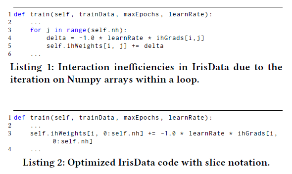。可以整个切片进行运算，却分开来一个个算。
  - 用相同参数重复调用无副作用的native函数：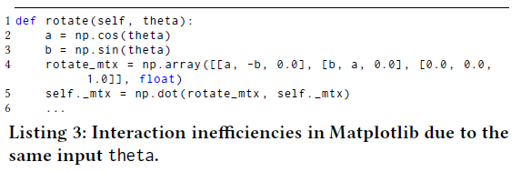，一个batch的`theta`是相同的，因此`a`、`b`、`rotate_mix`、`self._mtx`都是相同的。优化可得2.8X提升。
  - 算法问题
  - API误用：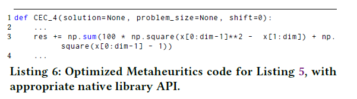 *这个例子其实和没有利用slicing重复*
  - 循环不变式计算：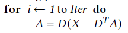 *这个优化在编译的时候也经常做，在Python没法做是因为它是对象。但是我们指导这是矩阵，就相当于数字。我们知道方法是无副作用的，就是运算。本质上就是无副作用方法的重复调用。*
  - *总结出了几个类别，又何必那么复杂监控程序运行？slicing问题或许可以建模。无副作用方法调用可以借鉴编译优化。*
- 低效率互操作模式：
  - 重复读取取相同值的相同对象 —— 内存重复读
  - 重复返回相同值的相同对象 —— 内存重复写
- **方法**：
  - 沙盒和保卫：
    - debug寄存器中断会唤起PieProf，中断Python运行时。若Python执行特定任务会导致错误。
    - 列出一些函数，给他们加一个包装。包装中暂时休眠PieProf，退出时启动。
    - 正在跟踪的地址在PyObject内部，可能被GC回收：添加引用。
    - 把内存地址转成PyObject：
      - PyObject存在于一定范围，可筛选
      - 若地址刚好是PyObject开头，能成功用动态类型转换
      - 对allocator进行搜索（*什么是allocator？它记录了所有对象的地址？*）
  - 测量方法：
    - 防止跟踪到解释器的内存访问
    - 防止同一个native函数的重复内存访问（因为我们关注的是不同函数之间的关系，同一个函数代码使然必然重复访问）
    - 过滤指令地址，限制在native function之内
    - 过滤内存访问地址，不在无效范围。如PyObject开头的地址，保存的是引用计数。垃圾回收对引用计数的访问一定很频繁。*怎么hack进Python运行时获得所有对象的地址？*
    - 对于一个冗余对，检查Python运行时状态是否相同，是则表示同一个native function 调用。*这里的native function似乎指的只是接口层，不过从上述低效率模式可看出，确实只关注接口层的冗余即可。*
  - 构建调用上下文树：
    1. 用libunwind获得native调用路径（整个程序，包含解释器的），提取出`_PyEval_EvalFrameDefault`。
    2. 映射PyFrame到Python代码调用
- **实验**：
  - 数据：17个项目，
- **评价**：这篇文章举的例子都是真实机器学习框架里面的，很好奇作者是怎么找到这么多例子。 

#### [SafeCheck: Safety Enhancement of Java Unsafe API]()
:::warning
补充 
:::
- ICSE 19

#### [Dual-force: understanding WebView malware via cross-language forced execution](https://dl.acm.org/doi/10.1145/3238147.3238221)
- ASE 18

#### [MUSEUM: Debugging real-world multilingual programs using mutation analysis](https://www.sciencedirect.com/science/article/pii/S0950584916302427)
- IST 17, Shin Hong (Handong Global U~), Taehoon Kwak, Yiru Jeon, Yunho Kim, Moonzoo Kim (Korea Institute of Science and Technology), Byeongcheol Lee, Bongseok Ko (Gwangju Institute of Science and Technology)

### 实证研究

#### Are Multi-language Design Smells Fault-prone? An Empirical Study
- TOSEM 21
- **主题**：
  - 多语言开发的设计气味（反面模式、代码气味
- **贡献**：
  - 提出方法来检测JNI系统的code smell

#### On the Vulnerability Proneness of Multilingual Code
- FSE 22 
- **主题**：多语言安全弱点的相关因素：语言选择、语言接口机制
- **RQ**：
  - 脆弱性与语言选择
  - 语言选择的什么因素导致更高的脆弱性
  - 脆弱性导致了实际的弱点吗？
- **方法**：
  - 项目选择：
    - 1000+ star，6个月内有更新，维护时间超过3年、没有改变语言
    - 查询语言使用，<1%的被排除掉
    - 选取时间跨度为3年的commit
    - 4001个项目
  - 弱点分类：
    - MITRE and the SANS Institute（**权威机构的分类**）：3类，prorous defenses，risky resource management，insecure interaction
    - 对25个top dangerous CWE不同分类**做词频分析**，得到关键词列表。
    - 用**fuzzywuzzy**做关键词匹配。直接关键词匹配会导致很多FN，用wildcard太多会导致太多FP。
    - vulnerability-fixing commit：在任意分类得分>90。
    - 141K个commits，36%，48%，16%
    - 采样500个commit，**人工验证**：读log、看代码
  - 语言机制分类：
    - 分类的来源：人工看代码总结的
    - 分类：
      - FFI：显式函数调用
      - 隐式调用：隐式地通过IPC
      - 具体化：相互独立，之间没有调用，但是可以相互丰富
      - 隐式交互：没有交互，通过外部的数据共享，比如文件，来协作
    - 实现分类：分析工具
  - 统计方法：
    - 朴素贝叶斯回归模型，应对数据超扩散

#### [The Python/C API: Evolution, Usage Statistics, and Bug Patterns](https://ieeexplore.ieee.org/document/9054835)
- SANER 20, Mingzhe Hu(USTC), Yu Zhang(USTC)
- **主题**：Python/C API和bug模式
- **方法**：
  - 提取官方的Python/C API：宏定义和函数声明 
- **感想**：
  - 文章短了很多，bug模式的总结有太多的主观性，没有维度的切分
  - bug怎么总结的？和前面的API演变和使用数据毫无关系。
  - 这篇文章毫无借鉴意义，很有可能只是学生竞赛投出来的。

#### Going Native: Using a Large-Scale Analysis of Android Apps to Create a Practical Native-Code Sandboxing Policy
- NDSS 16, Vitor Afonso, Antonio Bianchiy, Yanick Fratantonioy, Adam Doup´ez, Mario Polinox, Paulo de Geus, Christopher Kruegely, and Giovanni Vigna
- **背景**：
  - native code sandboxing：
    - NativeGuard、Robusta：出于安全考虑，把native code放到另一个进程中运行。可以避免native code篡改Dalvik runtime，也可以施加单独的安全策略
    - 线程级：Wedge，需要对kernel进行魔改
  - 
-**问题**：
  - real world的native code做什么？干的事和Java code一样？
  - native code和Java code的紧密性如何？是否通过side channel交流？
- 目标：生成一个合适的sandbox policy
- **方法**：
  - 用静态分析找到涉及native code的app
  - 用动态分析来分析app
- **结果**：

### 安全
#### NativeGuard: Protecting Android Applications from Third-Party Native Libraries
- WiSec 14，Mengtao Sun, Gang Tan
- **贡献**：
  - 使用Android 进程隔离来对native code沙盒。
  - 将原来的一个应用分成两个应用，native code所在的应用不再拥有权限。 
  - 本文主张应该细粒度地分配权限，比如native code和java code。而native code不一定需要整个应用的权限。
  - 同时native code会访问到整个应用的地址空间，破坏Java的安全模型。
- **Native Code权限**：
  - 本文主张Native Code**不会也不应该**请求权限
    - Native Code应该做计算密集型任务，访问系统资源的事情应该交给Java侧
    - Native code不应该直接访问API，应该以Java code作为中间介质
- **实验**：
  - 功能：写一个testing native library，不经过Java 直接访问API。
  - real world app：28个。人工检查能跑。
  - 性能：用MiBench（嵌入式系统的benchmark），取其中消费者设备的benchmark迁移到安卓进行测试。 

## 研究组

### [Gang Tan]()

### [HaiPeng Cai]()

### Sukyoung Ryu, Sungho Lee

- [ASE' 16](#hybridroid-static-analysis-framework-for-android-hybrid-applications)
- [ICSE' 19](#towards-understanding-and-reasoning-about-android-interoperations)
- [ISSTA' 19](#adlib-analyzer-for-mobile-ad-platform-libraries)
- [ISSTA' 19](#static-analysis-of-jni-programs-via-binary-decompilation)
- [ASE' 20](#broadening-horizons-of-multilingual-static-analysis-semantic-summary-extraction-from-c-code-for-jni-program-analysis)
- [ICSE' 21]()
- [TSE' 23](#static-analysis-of-jni-programs-via-binary-decompilation)
### [Tien N. Nguyen]()

### [Li Yi]()

### 分类和脉络

#### 跨语言场景

不同场景下所要应对的语言特性不同、挑战也不同。
##### Android Hybrid Application：JavaScript/Java
 
参考[hybriddroid](#hybridroid-static-analysis-framework-for-android-hybrid-applications)

##### traditional Android App(JNI, ADK)：Java/C
##### Numpy，Scipy：Python/C: 
##### Node.js JavaScript/C++

#### 目标：

##### 安全、隐私保护

NativeGuard要解决的跨语言接口是JNI，native code是C/C++，而应用代码用的是Android。用沙盒的方式，把native code和应用代码放到不同进程中，避免直接的内存交流。而且认为native code的主要工作是计算，不允许获得过多的系统权限，不允许访问API。应该将系统相关的工作移动至应用。

Adlib的跨语言场景是混合应用。AdSDK，native code是Java，而 

##### 缺陷检测

#### 分析方法

##### 单语言分析
和传统静态分析一样，但是充分考虑跨语言场景的特点，针对性地修改和设计分析方法来针对性解决跨语言场景下的问题。

###### 分析客语言：
这种分析着眼于一个个API，声称在调用一个API的过程中应该满足一些性质，比如引用计数不变、操作序列满足规约等。这种分析往往从一个API作为入口，去考察它之后的执行流和可达的一系列函数和方法。

[Siliang Li](#jet-exception-checking-in-the-java-native-interface)

###### 分析主语言：
这种分析往往是为了解决传统静态分析中如何处理环境的问题，也就是如何处理源代码不可用的问题。这种问题的一个情况就是，源代码是用其他语言编写而无法分析。他们的方法并不会强调解决的问题是跨语言问题，也并没有把限制在“不同语言”上，然而也有助于我们在跨语言的场景下分析程序。

最常用的方式就是对库API建模，或者叫桩（stub）。根据规约文档[^1]或者动态分析的运行时信息（[mimic](#mimic-computing-models-for-opaque-code)，[automatic model](#automatic-modeling-of-opaque-codefor-javascript-static-analysis)）。

[^1]: Zhai, J., Huang, J., Ma, S., Zhang, X., Tan, L., Zhao, J., Qin, F.: Automatic model generation from documentation for Java API functions. In: 2016 IEEE/ACM 38th International Conference on Software Engineering (ICSE), pp. 380–391. IEEE (2016)

[Magnus Madsen](#practical-static-analysis-of-javascript-applications-in-the-presence-of-frameworks-and-libraries)将库代码放到一边，也就是不根据库的源代码来还原和建模，而是从使用的一方分析。通过观察这些库API如何被使用的，从而推导关于API的性质。总的来说，他们的方法不关心API实际上怎么实现，只关心对这些API的使用是自洽的。

优点：
- 简单方便，直接使用相对成熟的静态分析技术
- 没有额外开销

缺点：
- 建模失真很大，只是
- 

##### 双语言分析

同时分析主语言和客语言
###### 统一表示
###### 统一建模
###### 分治

### 工具

### 数据集

----
### 记录
#### 关键字
- [x] cross language
- [x] inter-language
- [x] multi-language
- [x] JNI
- [x] foreign function
- [x] nodejs addons
- [x] android hybrid app
- [x] native
- [x] multi-lingual
- polyglot
- polylingual
- binding

