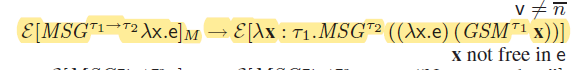

::: tip
看论文要关注：
1. **问题**。不要只看作者描述的问题，往往包装得天花乱坠，要看他落地解决了哪些。
2. **假设**。看似结果很好，但是有很多前提条件。要发现文章隐含的假设就更难了。
3. **贡献**。一两句话的概括。
4. **方法/创新点**。有些文章形式化写得很牛逼，一实现就很简单。此时的贡献就是形式化本身，而不是方法了。
:::

## 名词定义：一些摘抄
### 跨语言/多语言（Cross-Language/Multilingaul）
[broadening horizons](#broadening-horizons-of-multilingual-static-analysis-semantic-summary-extraction-from-c-code-for-jni-program-analysis):
> 多语言程序可以被分为主语言（host language）和客语言（guest language），主语言是提供FFI的一方，如JNI中的Java。两个通过外部函数接口（foreign function interface）交互，实现一个语言可以调用另外一个语言的函数并且交换数据。Python、Rust、Julia提供了语言级别的FFIs，Java和JavaScript提供了特定运行时环境的FFIs，如JNI和Node.js C++ addons。多语言程序可以利用不同语言的特性，对于开发者而言，利用多语言可以超过只用一种语言的表达能力。常见的是结合高阶语言和低阶语言。

### 跨语言分析（Cross-language Analysis）
[broadening horizons](#broadening-horizons-of-multilingual-static-analysis-semantic-summary-extraction-from-c-code-for-jni-program-analysis):
> 大多数静态分析针对一种语言，并且忽略了对外部函数的调用，因此产生不完整、不可靠的分析结果。WALA能够分析多种语言，但是不能分析由两种语言共同写成的程序。一些工作利用WALA能够分析用Java和JavaScript写的Android hybrid app。
>

### 语言边界（Language Boundary）
[broadening horizons](#broadening-horizons-of-multilingual-static-analysis-semantic-summary-extraction-from-c-code-for-jni-program-analysis):
> 显式的语言边界：调用外部函数和调用本语言的函数有语法上的不同，如JNI中Java中声明外部函数会使用关键字`native`。Go把所有的C函数放到`C`模块里面。等等。
> 隐式边界：把语言边界隐藏起来。如Python，调用C写成的模块与其他模块没有区别。

## 论文
### 静态
#### [Broadening horizons of multilingual static analysis: semantic summary extraction from C code for JNI program analysis](https://doi.org/10.1145/3324884.3416558)
:::warning TODO
补充问题、翻译的细节（指针？）、与[ilea](#ilea-inter-language-analysis-across-java-and-c)的不同
:::

- ASE 20, Sungho Lee(Chungnam National University), Hyogun Lee(KAIST), Sukyoung Ryu(KAIST)
- **问题**：针对跨语言的静态分析仍然不足。一些静态分析工具直接忽略外部函数调用，一些工具能分析多种语言但不能同时分析，一些工具能够分析Android hybrid app但仅限于这种情况，不具备可扩展性。
- **贡献**：
  - 尝试提出通用的多语言分析方法（如题目所说）：对客语言进行模块化分析提取摘要，只保留互操作有关的信息；对主语言（提供FFI的一方，Java）采用全程序分析。主语言分析对客语言的语义无知，只知道FFI语义和客语言的摘要。
  - 对类C语言的语义摘要提出形式化抽象语义
  - 实现了JNI分析器
- **方法**：
  - 模块分析客语言，提取摘要：
    - 模块化分析：对每一个函数抽象其输出状态和输入状态的关系。
    - 状态：抽象堆+外部调用
    - *状态怎么表示？怎么进行模块化分析？*
  - 生成摘要：参数、返回语句、外部调用
  - 翻译摘要至主语言、插入代码
  - 主语言分析：
- 两种bugs：
  - 错误调用外部函数：或运行时错误或未定义行为。本文能够检查错误的绑定和错误的C调用Java方法。
  - 错误处理Java异常：

#### [Towards Understanding and Reasoning About Android Interoperations](https://ieeexplore.ieee.org/document/8811927/)
- ICSE 19, Sora Bae(KAIST), Sungho Lee(KAIST), Sukyoung Ryu(KAIST)
- 贡献：
    - Android官方对Javascript和Java之间互操作的一些行为语焉不详，本文通过对安卓应用的测试、检查，观察到一些行为，提取作为互操作语义
    - 本文在形式化描述互操作时体现两个特性：动态、不可区分。动态：JS对Java对象的访问是动态的；不可区分：Java对JS来说是透明的。
    - 创造一个检查器，比HybridDroid快15倍。

:::info Android Hybrid App
为了实现跨平台以及克服浏览器的局限性，应用纷纷内置了“浏览器”，跨平台框架（Flutter、Reacti Native，Ironic，Cordova）。核心功能用javascript、css、html实现，但是框架提供插件使得hybrid app的能力比web app更强，能方便使用、访问平台（iOS，Android）和设备。
:::

#### [A Multilanguage Static Analysis of Python Programs with Native C Extensions](https://link.springer.com/10.1007/978-3-030-88806-0_16)
- SAS 21
- 问题：Python代码往往依赖native C代码。目前分析方法用stub来给C代码建模，但是要么耗时要么不准确。Python和C交互可能带来的问题：C没有异常处理；Python和C得数据表示不同，C存在溢出问题但Python对此无知。
- 贡献：
  - 设计了Python/C的语义
  - 在Mopsa下实现了对Python/C跨语言的流敏感、上下文敏感数据流分析。基于Mopsa现成的Python和C分析工具，检测C和Python的运行时错误
- 本文不采用自底向上地构建summary的方法，声称：
  - 分析动态类型语言不用上下文敏感很难讲分析得精确。*（这和动态类型有关吗？）*
  - 上下文敏感分析很难自底向上地分析。*（为啥？）*
  - C代码对Python堆已知是有必要的，方便检查指针错误，和分析副作用。
- 一些Python/C常见的[bug patterns](#the-pythonc-api-evolution-usage-statistics-and-bug-patterns)：
  - 返回null但是没有设置exception flag。
  - Python/C 数据类型转换错误（`PArg_ParseTuple`、`PyLong_FromLong`）
  - Python整型转换C整型导致溢出。
  - 引用计数错误（不解决）
- Python/C语义：
  - 假设：在C中，Python内建的对象只能通过API访问。C用API访问内建对象视作回调Python函数，也就是现在Python端读取，再使用某种Python $\rightarrow$ C转换语义。
  - Python状态：一切皆对象；堆就是地址$\rightarrow$对象，环境就是变量$\rightarrow$地址。
  - C状态：
    - 数据可以在堆中，也可以在栈中。表现为Cells，Base就是数据的基地址。
    - 指针不只是堆地址，还可以偏移。
    - 环境是每一个成员$\rightarrow$值
    - 堆用来标识内存有多大，数据是C内部（malloc）的还是Python（PyAlloc）的。C和Python共享Addr。
    - 对于Python对象，存在两个视角：Python视角下一个对象有基本类型（函数、类、实例、内建）以及它们的域；在C视角下，Python对象有成员。
  - boundary function：在Python对象的不同视角之间进行转换。Python对象同时在C和Python中被表示，如何把一边的表示翻译成另一边的表示。这种转换是抽象的，并不是具体的程序行为。
    - Python$\rightarrow$C：先翻译对象的类型（也是一个对象），然后在C堆中把Python对象（表示为一个地址）标记为`PyAlloc`大小为`PyObjectSize`。
    - C$\rightarrow$Python：如实地返回地址即可。
    - *在C中可以注册类的方法，也就是Python视角下对象的域，这怎么实现？*
  - Call：
    - C$\rightarrow$Python：函数就是C形式。检查第一个参数是否匹配函数绑定的类型；打包参数、翻译参数Python$\rightarrow$C；检查返回值是不是NULL，翻译返回值。
    - Python$\rightarrow$C：函数是C中的Python对象。翻译函数，翻译参数，在Python语义中调用。等等。
    - *C函数怎么在Python中表示？CFunc哪来的？*
  - 异常C$\rightarrow$Python：在C中，调用`PyErr_SetNone`，
  - builtin value转换: 
    - Long Python$\rightarrow$C: `PyLong_AsLong`把C中Python int对象转换为C int。方法为先翻译C中Python对象为Python表示，检查类型，检查取值，直接获取取值。
    - Long C$\rightarrow$Python: `PyLong_FromLong`C int转换为C中的Python int对象。方式为在Python语义中调用`int(...)`，再翻译为C。
    - 转换都是在C的语义下完成的，因为binding code就是用C写的。这个转换有具体的转换行为（代码中调用一个Python转换API）,将C int转换为Python对象。
  - 抽象语义：把上述的Number和Addr换成抽象表示。Number可以换成interval abstraction、octagon abstraction。Addr可以换成callsite、recency。
- 实验中，用“选择性”来展现他们工具的能力：工具计算的安全操作数/动态检查的数量。

#### [The Python/C API: Evolution, Usage Statistics, and Bug Patterns](https://ieeexplore.ieee.org/document/9054835)
- SANER 20, Mingzhe Hu(USTC), Yu Zhang(USTC)
- 利用工具从7个项目中提取Python/C API的使用和演变；手动总结了10个bug pattern。

#### [Bilingual Problems: Studying the Security Risks Incurred by Native Extensions in Scripting Languages](https://www.semanticscholar.org/paper/Bilingual-Problems%3A-Studying-the-Security-Risks-by-Staicu-Rahaman/681c9dac27366e20aa84fdb4992177dcf2aba9a2)
- 2021
- 问题：Python、Javscript、Ruby都允许用其他语言来写extension，而写extension的人可能会犯错，引入一些漏洞。
- 贡献：
  1. 总结了一些misuse模式
  2. 设计一个工具检查这些misuse，用于Node.js和npm上的包
- 几种错误：
  - 没有处理异常，导致crash
  - 参数翻译，Node.js的参数检查交给开发者来做。相比之下，*Python要求开发者指定参数数量和类型*。假如参数类型不对，两种native addons的处理还不同：或返回error code，或直接忽略；`\0`表示字符串的终结？
  - 缺少返回值，但是又尝试读取返回值会hard crash。
  - 调用C extension是同步的，可能会阻塞Node.js
  - 内存管理问题：缓冲区溢出，释放后使用、重复释放。
:::info Node.js API
1. Node.js addons开发早期用的是Node.js、v8提供的开发头文件。然而由于这两家更新频率很快，使得开发者叫苦不迭。
2. Native Abstractions for Node.js（NAN），用宏封装了上述头文件。Nan可以用宏自动判断版本，自动展开成相应的接口，使得API独立于Node.js版本。虽然源代码相同，但依然需要针对不同版本的Node.js进行编译，因此所有的二进制代码很多。而且只能用于v8引擎。
3. Node API（N-API）是Node.js基于C设计的API，用于摆脱对JS引擎的依赖。N-API包含了ABI（因为支持JIT，跨语言调用需要用ABI统一），ABI在大版本中保持稳定，不需要重新编译。node-addons-api在此之上提供C++封装。
:::
- 他们的方法是对JavaScript和C分别提取他们的过程内数据流。对于JavaScript，他们要找哪些函数用到了C API，并且根据下面的语法模式（各种脚本语言extension用来注册API的方法）来匹配C函数和API名字。然后，将JavaScript的函数和C的函数的数据流连接起来。对于他们要找的每个漏洞，指定一个sink节点，然后分析从JavaScript的entry node到sink node之间的路径有无sanitizer，有则安全，无则报警。

- 他们也推广到过程间分析。他们利用现成的调用图，从上述的vulnerable function开始倒推，用后向数据分析来做def-use分析。
- 和[binding](#finding-and-preventing-bugs-in-javascript-bindings)类似，这篇论文偏安全方向，里面提到了很多跨语言交互的一些细节，但是他们是把它当作一个个可能存在的漏洞提出来的，而不是建立全面的semantic来描述这些行为。感觉有些琐碎了。

#### [Finding and Preventing Bugs in JavaScript Bindings](https://ieeexplore.ieee.org/stampPDF/getPDF.jsp?tp=&arnumber=7958598&ref=&tag=1)
- SP 17
- 问题：一些Javascript的底层和addon是用C++实现的，写的时候需要用binding code来粘合javascript和C++，翻译数据类型、数据表示、传递异常处理等。binding code容易程序员编写，容易写错，导致：crash、跳过类型、边界检查。binding code可以调用javascript代码。使之更容易被劫持。
- 贡献：
  - 总结了三种安全的违反（bug）：crash-safety、type-safety、memory-safety。
  - 提出检查器来发现上面三种bug，支持多个runtime：nodejs、chrome blink、chrome extension、pdfium。*但应该是面向v8引擎分析*
  - 把v8引擎api包装成安全的api
- 本文是安全方向的论文，因此在提及bug的时候总是强调它们是exploitable的或者可能导致什么后果。
- bugs:
  - crash-safety: 发生硬crash
  - type-safety：没有检查类型就使用或者转换
  - memory-safety：内存访问错误，如数组越界。挑战在于binding code回调javascript函数可能会改变数组长度。
- Checker：
  - 用[microchex](https://cseweb.ucsd.edu/~dstefan/cse291-fall16/notes/uchex/)（他们组16年的工作）语法检查器来发现bug。这个工具接受小语法（编程语言语法的一部分），这个小语法以某个特定的分析为导向编写（如空指针分析，那么小语法专注于发现指针解引用和指针赋值）。这个分析是path-sensitive的。这个工具无法进行过程间分析，无法进行别名分析。 
  - *本质上与其他静态分析没区别，别的静态分析基于AST，它的静态分析基于化简的语法树，边扫描便分析。*
  - Hard Crash bugs：
    - assertion：假如ASSERT、CHECK里面是来自javascript的变量就报错。
    - unsafe-conversion：。。。
  - type safety：收集没有经过类型检查的参数，假如cast了就报错。
  - memory-safety：
    - 依赖隐式转换的内存操作：隐式转换指的是可能隐式地调用`Symbol.toPrimitive`的方法，如`UInt32()`。假如一个值是通过隐式转换得到，则称之为危险值。若危险值出现在`malloc`、`memcpy`就报错。（隐式转换可能被劫持，这样数组长度会改变，内存操作就危险了。但是为啥一定是危险值作内存操作的参数才报错呢？莫名其妙）
    - PDFium use-after-frees：凡是调用了javascript的函数就认为当前所有指针是可能被free的。
- 这篇论文只面向binding code进行分析，我觉得并没有“跨语言”，本质上仍是C++程序分析。但本文确实有关跨语言，那3种bugs就是跨语言场景下才存在的bug，所以这是在跨语言场景下对C++进行分析。而且这里的bug并不是指运行时出错，而是我可以手动创造条件（自己编写javascript代码）来触发，所以分析得更加保守。我觉得这篇论文一般。

#### [Ilea: inter-language analysis across java and c](https://dl.acm.org/doi/10.1145/1297105.1297031)
::: warning TODO
补充翻译的细节，与[semantic summary extraction](#broadening-horizons-of-multilingual-static-analysis-semantic-summary-extraction-from-c-code-for-jni-program-analysis)对照
:::

- OOPSLA 07, Gang Tan (Boston College), Greg Morrisett (Harvard U~)
- **问题**：之前的静态程序分析限定在一个语言中，但是Java中JNI的使用还是很多的。
- 论文首先讨论了如何给C做规约的问题（如何描述C代码的行为）。其中一种方法是用标记，标记有无副作用、nullable甚至数据流值，但是这种方法过于ad-hoc，不具备可扩展性。他们决定用霍尔逻辑去描述C代码，捕捉运行前-运行后的关系：返回值与参数、运行前的Java堆-运行后的Java堆，抛弃C的执行步骤和C的堆。
- **方法**：为了同时分析Java和C，他们选择把C代码翻译成Java虚拟机语言（JVML），具体来是扩展的JVML。

#### [Operational Semantics for Multi-Language Programs](https://dl.acm.org/doi/10.1145/1190216.1190220)
- POPL 07, Jacob Matthews (U~ of Chicago), Robert Bruce Findler
- 背景：foreign functions既包括高阶安全语言调用低阶不安全语言(如Java与C)，也包括高阶安全语言调用其他高阶安全语言（Python和Scheme）。前面的研究着眼于如何实现这种交互，在比特的层面解决交互的问题，缺少对多语言程序形式化推理的工作。
- 贡献：
  - 本文提出ML和Scheme的多语言操作语义。
  - 可以用来证明type soundness和上下文一致性
  - 基于boundaries：可以把控制流和数据在两种语言中转换
- 肿块嵌入：两种语言可以看到对方的值，但是不能使用，只能把它返回给对方
  - 简单容易实现
  - 符合一些多语言系统：Haskell给C程序一个指针，C只能返回不能取值来用。
  - 引入语法的边界：先写出两个语言的语法展开式，然后加入转换操作（相当于一种运算、一种表达式）：把一个语言非终结符可以由另一个语言的非终结符用转换操作得到。这个转换仅仅只是语法上的转换，并无实际含义。（M表示ML、S表示Scheme，靠近哪边表示哪边是什么语言）
  - 统一类型系统：Scheme是无类型的，为了实现统一的类型系统以及肿块（禁止访问对方语言的数据），
    - 给Scheme添加TST类型，表示Scheme自己的类型；L表示Scheme在ML中的类型；ML在Scheme中的类型就是TST。
    - 归约规则对对方的类型无知。Scheme->ML：Scheme类型都是TST。转换成ML后的类型取决于这个数据怎么来的，假如是Scheme内部的数据就是L；假如是ML传进去又返回出来的数据，就保留原来的类型$\tau$。
    - 肿块体现在：**没有把SM(n)、MS(n)变成n的规则,也没有把SM(λx.e)/MS(λx.e)变为...的规则**，因此没法参与运算（+/-），没法apply。这就像一个tag一样一直跟随着v进行规约（if，λ），直到遇到相反的转换操作。简而言之，**无法将一个语言的数据类型转换为另一个语言的数据类型，如string->char[]**
 - 简单自然嵌入：在肿块嵌入的基础上添加数据类型的转换
   - 对于数字，添加相应的转换操作
   - 
   - 无类型Scheme -> 有类型ML：类型任意。动态检查是否搞错number/function
     - number/function搞错=>立即报错；
   - Scheme函数->ML函数：包装成ML函数，任意函数类型。函数体是把参数M->S后，在Scheme的上下文中调用Scheme函数，把返回值S->M（同上，类型任意）。
     - 参数类型搞错=>Scheme内部报错；
     - 返回值number/function搞错=>立即报错；
     - 返回值是函数，但是具体类型搞错=>下次再说；
     - type safety要求程序never goes wrong（卡住或者未定义）。而添加error状态后的Scheme是不会stuck的。
   - ML函数->Scheme函数：包装成Scheme函数。函数体中先S->M翻译参数，可能报错，然后在ML上下文调用函数，然后M->S翻译返回值。
   - 检查然后报错被称为**guard**，说白了就是动态类型检查。静态类型语言不会进行动态类型检查，而无类型的就会。要让ML使用Scheme的函数，就要添加动态类型检查机制。而Scheme用ML的就不需要，因为它本来就有动态类型检查。ML在使用Scheme数据要用动态类型检查，这个检查只区分number还是function是因为：
     - 可行，number和函数在语法构造上（语法不要理解为静态的代码，而是运行时程序的抽象表示！）不同，可以写成归约规则。而函数类型是无穷的，所以没法针对每一种函数类型进行转换。由此类推，若数据是个无类型对象，也是无法检查的。（也就是检查）
     - 没有必要进一步区分。ML其实不在乎Scheme函数的类型，只担心从Scheme的基本数据类型，因此只要对返回值进行类型检查即可。
     - 由此可见，不区分number和function也是可行的，推迟到使用时再检查有何不可？对于加法，我检查操作数是不是Scheme的数字，此时再报错。但是：
       - 推迟了不好，不好溯源。明明可检查干嘛不检查。
       - ML作为静态类型语言，却让动态类型检查分布到整个程序。
- Guard分离嵌入：在自然嵌入的基础上，在Scheme一侧引入Guard操作。Guard不进行转换，只进行检查。因此转换操作只需无脑转即可。假如一个数据没有经过guard就转换，会卡住。 
  - 要求程序一开始时必须形如：   由此来保证type soundess。
  - 在ML调用Scheme的函数，为什么要检查参数？简单自然嵌入中  $GSM$不会检查x是不是数字啊？
  - 但若参数x传递一个函数λx.e，t1=t3 \rightarrow t4。GSM要翻译成$λx. GSM^{τ2}(v MSG^{τ1} x)$。也就是带动态检查的Scheme函数，在检查给ML的参数。
  - $G^t$有两个功能：检查它是函数还是number；对于函数还生成带有检查的封装函数：Guard返回值和Guard参数。假如这个参数有朝一日传进来一个ML函数，G参数会再生成一个封装函数：也是Guard参数、Guard返回值。此时Guard参数就是必要的，因为这是传给ML函数的。
  - 对于$G^{(t1 \rightarrow t2) \rightarrow t3}$，不仅检查返回值t3，还要检查参数t1->t2。进一步的，有朝一日，检查参数t1->t2的时候，要检查参数的参数t1，这个参数是要传递给ML的。
  - 分离嵌入和简单嵌入其实是等价的。因为要求初始程序G和SM/MS必须成对出现，而G和SM/MS都是对函数的作用都是生成一个带封装的函数：$G^t·SM^t(λx.e) \implies G^t·SM^t (λx.e\ SM^t·G^t)$。不同在于：这里的G并不根据当前的SM/MS来选择性检查；但是GSM不会检查，MSG才检查；
- contract嵌入：把转换和检查分离后，可以看到一些冗余的检查。对于$MS·G^{int \rightarrow t}$，检查参数是不必要的。对于$G^{t \rightarrow int}·SM$来说，检查返回值也是不必要的。本来ML->Scheme的基本数据类型都不需要检查，怕的是传递ML的函数！
  - 
  - $G_+^t$：
    - 判断是不是number/function，报错； 加封装。
    - 用于Scheme->ML：总是判断类型、报错；对于函数，还生成带检查的封装，但是对返回值用$G_+^t2$，对参数用$G_-^t1$，因为参数的方向是ML->Scheme！
  - $G_-^t$：
    - 不会报错，只会加封装。
    - 对于t=int，它是哑的：既不报错，也不生成封装函数。
    - 用于ML->Scheme。
  - 和简单嵌入一样的事：检查和转换不分家，该检查时才检查。
- 他们证明自然嵌入是可以写成肿块嵌入的。*没看明白*。
- 异常处理：ML异常处理，Scheme有try-catch
  - 
  - 拓展类型到$\Kappa$。加入$\lota !$，表示用成功/异常当返回值（数字）。这个类型只出现在转换中，不会出现在ML的类型系统中。扩展的类型不仅指定了转换API要转换成什么类型，也指定了怎么（在ML中）处理（Scheme的）异常。
  - Scheme的上下文分为H和E，H表示没有异常处理的上下文，E表示所有上下文。这使得Scheme无法处理由ML返回的异常（当返回值为0）。
   
#### [JuCify: a step towards Android code unification for enhanced static analysis](https://dl.acm.org/doi/10.1145/3510003.3512766)

:::warning TODO
与[semantic extraction](#broadening-horizons-of-multilingual-static-analysis-semantic-summary-extraction-from-c-code-for-jni-program-analysis)对比
:::

- ICSE 2022
- 问题：恶意软件可能在Android的native code里面。当前分析native code的方法是临时的，对bytecode和native code的分开分析，然后再把结果统合在一起 *（JN-SANF？DroidNative？NativeGuard？TaintArt？）*，缺少统一模型。
- 贡献：
  - Jucify：生成包含native代码的统一Jimple表示。
  - Jucify直接在**二进制层面**进行分析：bytecode和native binaries。
- 生成统一的调用图：
  1. 构建native callgraph。用ANGR，二进制分析工具。
  2. 提取双向的调用信息。
     1. 提取bytecode方法类型、签名。ANDROGUARD。
     2. 提取entry方法（用`native`声明的方法）的调用。entry方法是指native函数被bytecode调用。
     3. 把entry方法（bytecode）和entry函数（native）匹配起来。既包含静态注册（函数名满足命名规范）和动态注册（符号执行）。
     4. 提取exit方法调用。exit方法是指bytecode的方法被native调用。这里是获取entry-exit对，从entry函数开始符号执行，从二进制码中（ARM）找到函数调用和返回，模拟函数调用。
  3. 修剪native callgraph，保留从entry可达的部分。把它转换为soot形式。
  4. 利用native-bytecode（host language）相互调用的信息联合两边的callgraph。
- 用Jimple来表示bytecode和native code
  - 用DummyBinaryClass来表示native代码，native函数就是它的方法。
  - bytecode对entry method的调用改成对DummyBinaryClass方法的调用。
  - native code转Jimple是围绕返回值和exit调用的。抛弃了数据流图，排列组合来枚举exit参数和返回值。在函数签名的参数声明、可以推导的其他变量（exit方法返回值的结果变量，调用exit方法的接收对象等）枚举。保守估计。
  - 本质上是对native代码建模，但是相当粗糙。
    

       
       
    

### 动态
#### [Mimic: computing models for opaque code](https://dl.acm.org/doi/10.1145/2786805.2786875)
:::warning TODO
把问题、贡献、方法补全
:::
- FSE 15
- 动态分析给C建模。运行C函数，捕获traces，通过traces来建模。

####  [Automatic Modeling of Opaque Codefor JavaScript Static Analysis](https://dl.acm.org/doi/10.1145/2025113.2025125)
- FASE 19, Joonyoung Park（Oracle\KAIST）、Sukyoung Ryu（KAIST）
- 动态分析C函数。通过组合测试的方法。对于js端的数据流分析，对于调用C端函数的程序点，对参数的抽象值采样具体取值。然后调用C端函数跑一遍，对返回值再抽象回去。
- 不保证soundness；基本类型采样可理解，怎么对对象采样没搞懂；采样没有什么高明的方法，依靠启发式。
    
#### [Language-agnostic dynamic analysis of multilingual code: promises, pitfalls, and prospects](https://dl.acm.org/doi/10.1145/3540250.3560880)
- FSE 22, Haoran Yang (Washington State U~)、Wen Li、Haipeng Cai
- 本文是对ORBS的验证论文。ORBS是不分语言的动态分析，旨在在多种语言混合的场景下进行程序切片。
- 本文的结论是做不分语言的动态分析并不实际也无必要：
    1. 统一抽象语义并不可扩展
    2. IR转换需要大量工程上的工作，并不实际。LLVM提供了统一的IR，但是很多语言的前端却缺少维护。
    3. 用元模型来抽象不同语言的执行，和具体的动态执行本身是矛盾的。

## 研究组

### [Gang Tan]()

### [Wen Li]()

## 资源

### 工具

### 数据集

----
### 记录
继续搜索：JNI, FFI, foregin function, nodejs addons, cgo, android hybrid app, language boundary
