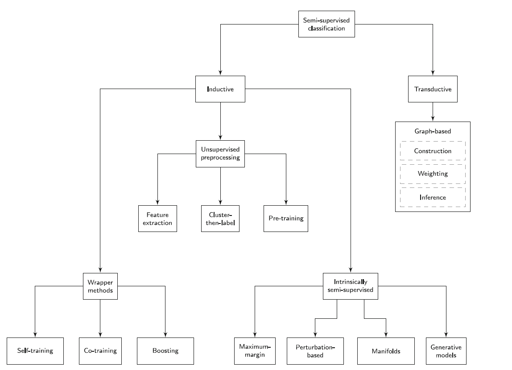

#### [A survey on semi-supervised learning](https://doi.org/10.1007/s10994-019-05855-6)
- 半监督学习旨在用标记与未标记的数据来执行学习任务。大部分半监督学习着眼于分类问题。
- 半监督学习能做的前提假设：$p(x)$包含$p(y|x)$的信息，因此通过观察x的分布，我们能够得到分类。一般要满足一个或多个以下假设：
  - 连续假设：x相近，则y相同。*暗示着不同类别不会混杂在一起，应该有明显分别*
  - 低密度假设：超平面不应该穿过高密度数据区域。*暗示着不同类别应该有显著距离，大于类内距离*
  - 流形假设：在同一个低维度流形应该有相同标签。*连续假设和低密度假设的拓展版：相同的流形暗示着它们在流形上相近；存在不同的流形暗示着数据点之间存在明显的距离*
- 半监督学习并不能保证在引入未标记数据后一定能提升性能，相反有时还会退步。
- 评估半监督学习方法需要做以下决定：
  - 设计数据集哪些是标记、哪些未标记。数据集一般是从有标记的数据中去掉标记得到的。
  - 要在训练集的未标记节点做预测还是测试集
  - 设置有监督学习的基准线
- 半监督学习的分类：
  - 归纳方法：目的是构建一个模型，预测其他未标注数据。一般是有监督学习方法的扩展，通过引入未标记数据。
      - 包装方法：用有监督方法学习已标记数据，然后根据训练出来的分类模型给未标记数据打上伪标记。然后把伪标记数据加入数据集再次训练。特点是：对于所有的有监督学习方法，都能转变成相应的包装方法。
      - 无监督预处理方法：对数据点特征提取、聚类、用无监督的方式确定有监督学习的初始参数。任何有监督分类方法都可扩展，但是此时有监督分类只用于对已标记数据进行分类。
      - 半监督本质方法：把有监督方法的目标函数直接扩展到无标记数据，如S3VM
  - 直推方法： 目的是预测训练集中的未标记数据，没有预测模型，没有训练和测试阶段。
    - 标记不是通过预测，而是在数据之间传播。因此直推方法天然都是Graph-based的。
    - 基于流形假设。
    - 三步：建图、边加权重、推理
