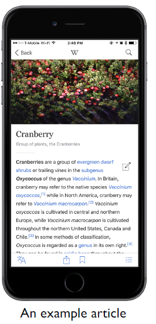

## 读论文感想

### 讲故事很重要
把一个故事讲得生动、完善，给人的观感是很舒服的。我在组会报告论文时也喜欢那种娓娓道来、条理清晰的文章。有可能他的工作做的不咋地，但至少要给人工作做得很完整、很完善的感觉。

#### 图要做得好
1. 箭头不要到处飞
2. 代码截图不要随意堆砌
3. 可以加上没有意义的示意图：有些示意图并不能帮助理解。尤其是介绍motivation example。例如，在描述一个WebView app的跨语言交互时，可以摆上具体的app截图。 虽然这个截图并没有什么用，但是让文章更生动一点。

可能需要图表的地方：
1. 各种example
2. 方法流程

#### 例子要搞得多多的

有些东西太过细节、太过复杂，光用文字描述不清。这时候我往往希望看到例子。而那些没有及时摆上例子的文章，就让我很不爽。
说白了，还是要把文章写得清晰易懂，让人看不懂的东西（不是因为理论很高深，仅仅是因为不了解这个领域或者场景）太多，会让人很不爽。

有时可能具体到解释某个名词而已，此时只需要e.g.即可。

可能需要例子的地方：
1. introduction里面论证方法不适用的时候
1. 讲方法的步骤的时候

#### 背景介绍要到位

对于涉及的其他概念，至少给一句话介绍。不能默认观众已经知道了。

### 搞清楚论文的面子和里子

#### 不要太关注contributions
要看清文章的闪光点是什么。

文章里的contributions更多是一种叙述方式，作为论文的一个必要组成部分而存在。

就好像你要卖一个空调，那么你的空调肯定有制冷模式。没有制冷模式的空调怎么能叫空调呢？然而空调之间质量良莠不齐，它说有制冷模式不代表真的能吹冷气。能不能吹冷气得自己用手判断。

同理，论文就是“声称自己做出了点东西”的文章。所有文章都有这个结构，都会装作做出了东西。

因此，**contributions更应该理解为文章的主题**，它简明扼要地告诉读者本文做了件什么事。

空调的质量由国家标准把关，而论文的质量靠会议/期刊把关，靠CCF A/B/C。但是，它何能评上CCF A，绝不会因为它自称有“超强制冷模式”。它能评上CCF A的原因，要自己用手摸。

总而言之，不要把文章的contributions看作成果。要去发掘它真正的闪光点。或者说，从审稿人角度看文章。
这依赖于大量的论文积累，和论文对比。要多比较A会论文和B会论文。

可能的闪光点：
1. 有显著效果
2. 方法创新（不一定make sense，但是效果好就够了）

#### 关注结果

挑战、困难和方法更多靠包装。这里并不是说虚构一个挑战或者方法，但是你言过其实，把一个不重要的东西说得很重要，把一个不是很难的东西说得很难，也没人看出来。
因为别人没有具体上手去做，也不知道实际上有多难。

但实验数据别人是可以检验的。最重要还是去证明你的成果是有用的。

因此看文章也应该围绕着成果。前面的部分都是包装，只有最后的结果是实打实的。

数据是重中之重。数据才能证明成果的显著，数据也是用来发现水货的。

数据需要详尽，但也不至于trivial。

作为观众，也要多想想论文缺少了什么数据？假如缺少了这些数据可以怎么掺水？

#### 快速判断水货

比如，常见的水论文体现在：实验数据很不好。论文肯定不会直接表明实验数据很差，他们会做一些伪装。所以，**实验部分要认真看**，看指标合不合理，看论证扎不扎实。看这一部分的时候，批判性思维要拉满！

### 如何学习

学习不仅限于看论文。听报告、看文档、看博客、看教科书，都是学习的过程。

#### 带着问题去看

在开始看之前，要明确自己的问题是什么？这样，我才能知道我的答案是什么。

假如没有想好问题就匆匆看文档，虽然我会感觉到收益匪浅，虽然我会发现有很多我之前不知道的知识，但是**我不能记住这些知识**。看完之后，没有take away，什么结论也得不出，那么我看这个文档的意义在哪？作用在哪？它怎么推进我的工作？

**问题一定要明确地表达出来**，不够具体的问题不会有答案。

#### 主动回答问题，以验证的眼光看论文

产生问题是简单的。人最开始就是无知的，上面一节也只是说要发现自己的无知。难点在于去消除无知。

作为学生，我们可以等着老师投喂答案。但是现在不能了，我们要把自己对标教授，对标专业人士。**我们就是回答问题的人**。我们不可能一蹴而就，因此我们需要在日常中就不断地回答问题。

有两种情况更加需要我们提前想好答案：

我们要去**评估论文的闪光点**，要去发现论文精彩的地方。或者说，我们要**跳过论文里面繁琐的trivial**的部分，聚焦于重点。

那我们需要做好预期，否则论文处处都是精彩，每个地方都去看，那就浪费时间了。

在这种情况下，我们要提前总结出**我的预期**是什么、**我的猜测**是什么，直接去论文里面搜索它、验证。**回答也需要明确**，否则也就无法验证了。

假如发现论文不是这么做了，太好了，这就是**文章的亮点**。

还有很多时候，我们看到一段模糊的描述，我们知道大概的意思，却也**把握不准具体含义**。

此时，我们要自己去解答、去利用我们的知识、发挥合理的想象。

最关键的是，我们**要自信我们的回答是正确的**。要自信自己是最懂这个领域的人之一，不抱着这样的心态就永远成为不了。因此要自信自己的答案就算不对也八九不离十。

犯错是难免的，但是什么问题都不去推测，让脑袋空空的，过了一会，我们既找不到答案，也把一开始的问题也忘了。到头来，我们什么也没学到，什么也没记住。
给出一个推测，至少我们还有一个结论。更重要的是，当我们看到相反的事实，我们可以马上反应过来之前的理解是错的。

#### 多概括

常常感到学到了很多，但是想要去复述，却哑口无言了。在这种情况下，我真的学到了东西吗？仅仅记住一个大概，在看到类似的东西之后能够想起在哪里看到有关描述就够了？这样的话，我也只是一遍又一遍地重复阅读，始终没有学到啊。

要产生take away。要把模糊的知识变成明确的知识。而明确的知识加上重复才等于记忆。但是没有明确的知识，我就没有能够记忆的客体。

除了上述的“提出问题 - 回答问题”，这能得到take away的知识，我们不断地总结内容，用**一句话概括**。从细粒度开始到粗线条。
